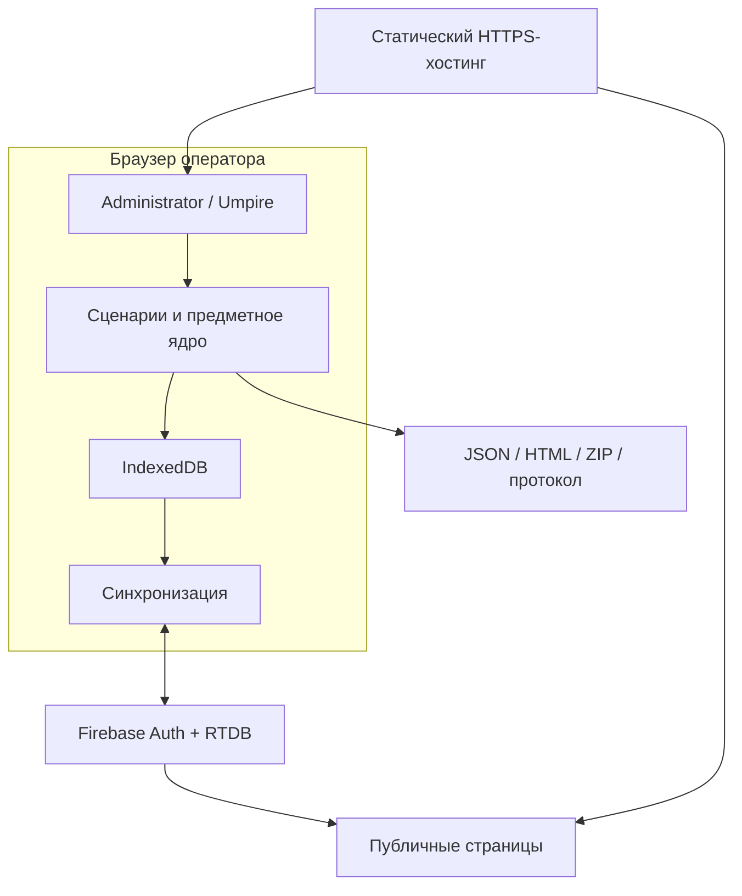
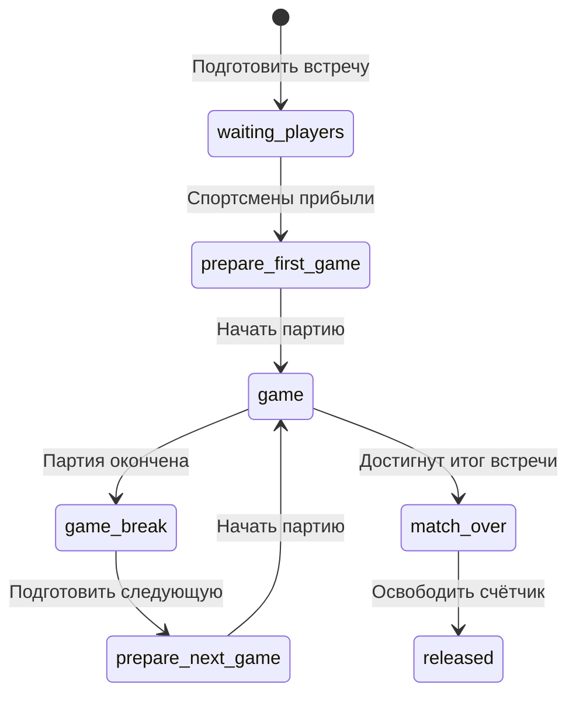
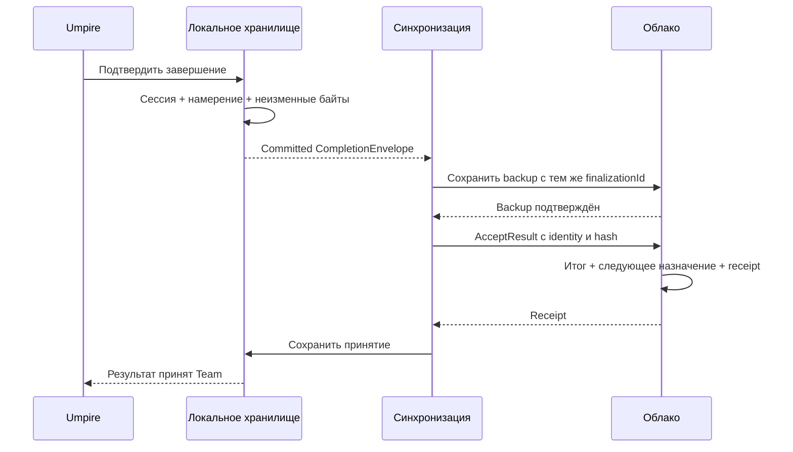

# Архитектура нового приложения для командной встречи по настольному теннису

Версия документа: **1.0.0-draft.1** · Дата: **2026-09-18**

Статус: завершённое архитектурное предложение для разработки и проверки. Приложение по этой архитектуре ещё не реализовано. Выбор решений в документе — результат проектирования по поручению пользователя; он не означает приёмки будущего продукта или разрешения менять действующее развёртывание.

Рабочее обозначение нового продукта: **ttScore Next**. Это обозначение используется только в документе и не задаёт имя выпуска.

Для быстрого чтения: §1 — выбранная конструкция; §4 — охват функций; §6–10 — собственно архитектура; §11–14 — транзакции и восстановление; §18–20 — проверка, реализация и условия пересмотра.

## 1. Проектное решение

Создать **одно модульное веб-приложение с локальным ведением личной встречи**, общим предметным ядром и отдельными интерфейсами Administrator, Umpire и зрителя. Сохранить пользовательские возможности предоставленного ttScore suite RC8, но заново определить модель данных, границы ответственности, хранение и взаимодействия.

Выбранная конструкция:

- Статические HTML/CSS/JavaScript-файлы на HTTPS-хостинге, пригодные для размещения на GitHub Pages.
- Чистые функции предметного ядра: правила личной встречи, командная очередь, переходы фаз, проекции счётчика и отчёта.
- IndexedDB для текущей локальной встречи, последнего Undo и единственного незавершённого пакета передачи результата. Изменения этих данных сохраняются одной транзакцией.
- Один облачный контур Firebase Auth + Realtime Database для новой схемы Team, регистрации попыток, резервных отчётов и Live. Собственный постоянно работающий сервер приложения не требуется.
- При вводе очка облако не участвует в принятии локального решения. Team и Live получают только успешно сохранённые снимки.
- Итог личной встречи, подтверждение Umpire и принятие результата Team — разные факты. Team засчитывает результат атомарно, с защитой от повторной передачи.
- Постоянные зрительские страницы читают данные напрямую через общий модуль просмотра. Для собственного Live новое приложение не использует вложенную страницу счётчика в iframe.

Главный архитектурный принцип: **у каждого изменяемого факта один источник истины; остальные представления имеют явную связь с его идентичностью и редакцией**.

«С нуля» здесь означает новое внутреннее устройство. Существующий код служит источником наблюдаемых функций, форматов и пограничных случаев. Его глобальные переменные, файловое разбиение, localStorage-ключи и последовательности вызовов не переносятся как обязательная конструкция.

## 2. Основания и границы исследования

### 2.1. Точные входные материалы

| Код | Материал | Идентификация |
|---|---|---|
| S1 | `ttscore_suite_0.4.0-rc.8(1).zip` | SHA-256 `3e75b114db103367be8732bbf8cb737454f092a45328aeed4e8b520408f1ce20` |
| S2 | `FPF-main.zip` | SHA-256 `1615e5bde6375446e163fcfecc191da63f54af12cb07ef5eba1589c312dcf9f5`; снимок файлов от 2026-09-16; ZIP comment: `8581bcf6502498b53aaa9fd42ed925a1371c08d1` |

В S1 корневая папка называется `ttscore_suite_0.4.0`, компоненты — **ttScore 0.10.0** и **ttscore_team 0.13.0**. Номер RC определяется документами выпуска, а не только именем внутренней папки.

Изучены README, цель 0.4.0, уточнения владельца, политика управляющих вкладок, KNOWN_ISSUES, DECISION, VERIFICATION, предметная модель и редактор Team, создание расписания, интеграционные контракты, значимые участки счётчика, отчётов, Live и его читателей. Функции ниже восстановлены по документации и статическому чтению кода. Полная исполняемая проверка RC8 и новая полевая проверка не проводились.

Входной `DECISION.md` имеет решение **STABILIZE**. Он сообщает о 246 автоматических проверках, но прямо оставляет полевую проверку точного RC8 открытой. Эти результаты принадлежат входному артефакту; настоящий документ не объявляет их собственным тестированием или доказательством готовности нового приложения.

### 2.2. Как разрешены неоднозначности

1. Функциональный ориентир — предоставленный RC8, включая его явные ограничения и поздние уточнения. Исторические версии внутри постановки цели не подменяют его.
2. В старом тексте цели встречается упоминание намеренной паузы Live. Более поздние `OWNER_SCOPE_UPDATE.md`, README и интерфейс Team подтверждают: **пользовательской Pause Live в связанном режиме нет**.
3. Standalone имеет собственное ручное включение и остановку Live. Это сохраняется; запрет Pause Live для Team не удаляет standalone-возможности.
4. В RC8 локальный Undo хранит до 50 шагов в памяти и один шаг после reload. Архитектура сохраняет именно это поведение.
5. Старые ограничения «не менять backend», «не вводить outbox» относились к ограниченному изменению прежнего продукта. Здесь проектируется новое приложение. Однако произвольная очередь нескольких незавершённых встреч не нужна: достаточно одного атомарного пакета завершения. Новая облачная схема выделяется отдельно; действующие данные и правила не изменяются этой работой.
6. Для воспроизведения счёта используется профиль поведения RC8. Исходный Appendix A в этом архиве отсутствует как самостоятельный первоисточник. Соответствие всему ITTF Handbook не заявляется.

### 2.3. Что считается функциональной эквивалентностью

Сохраняются действия ролей, спортивные результаты, смысл показаний, публичные сценарии, восстановление, поддерживаемые документы и ручные обходные пути. Допускается изменить внутренние схемы, сборку, транспортные адреса нового контура и расположение элементов интерфейса. Для старых пользовательских ссылок требуется явный совместимый маршрут или сохранённый старый читатель (§16).

Ошибки RC8 не становятся требованиями нового продукта. Для каждой устранённой причины указаны механизм и ещё необходимые проверки. Успешное устранение в реализации пока не доказано.

## 3. Система, участники и среда

Проектируемая система включает клиентское приложение, новую облачную схему и правила доступа, форматы обмена, сборку и инструкции восстановления. Физическая встреча, решения Umpire о розыгрыше, устройства, браузеры, сеть и облачный провайдер — внешние участники и условия использования.

| Участник | Ответственность | Что приложение обеспечивает |
|---|---|---|
| Administrator | Составы, расписание, ручной результат, Team Undo, ссылки, публикация и архив | Командное состояние, защита от конфликтующих изменений, явный аварийный путь |
| Umpire | Исходная расстановка, объявление начала, ввод победителя розыгрыша, коррекция, подтверждение завершения | Быстрый счёт, подсказки, сохранение, отчёт, автоматическая передача |
| Зритель | Просмотр | Командный итог, текущая пара, табло, отчёт, понятное ожидание и потеря актуальности |
| Владелец развёртывания | Публикация проверенной сборки, настройка доступа, сохранение архива | Повторяемый комплект клиент + схемы + Rules + инструкция отката |

Administrator и Umpire доверяют друг другу. Их различие — рабочая ответственность и доступные действия интерфейса, без новой системы судейских аккаунтов, назначения ролей и RBAC. Техническая авторизация редактора для облачных записей сохраняется. Анонимный зритель не получает право записи.

Целевая среда: сенсорные браузеры iPhone/iPad, в том числе Safari; один человек может использовать разные браузеры или устройства. Установка нативного приложения и инструменты разработчика для эксплуатации не нужны. Точные версии браузеров фиксируются при приёмке. Параллельные read-only страницы разрешены.

В одном origin и профиле браузера допускается один управляющий Team-контекст. Administrator и Umpire могут работать в разных вкладках с одной командной встречей. Между браузерами нет общего локального хранилища: передача между устройствами использует облако. Web Locks действуют в пределах origin; запрет между разными доменами или разными профилями ими не обеспечивается [W4].

Отключение интернета не останавливает уже открытую локальную встречу. Новая холодная загрузка приложения без сети не является обязательством эквивалентности. Гарантия полноценного офлайн-запуска потребовала бы отдельного решения о кэшировании оболочки и её обновлении.

## 4. Восстановленный функциональный контракт

Обозначения компонентов используются далее: **TEAM**, **SCORE**, **FLOW**, **STORE**, **SYNC**, **LIVE**, **REPORT**, **IO**, **UX**, **ACCESS**.

Пути источников в таблице относительны `ttscore_suite_0.4.0/`. Сокращение `assets/` означает `team/assets/0.13.0/`. Указанные функции позволяют найти точное основание без зависимости от номера строки.

| ID | Сохраняемая возможность | Основание в RC8 | Владелец новой функции |
|---|---|---|---|
| F01 | Команды 2×2, 3×3, 4×4; дата, место, названия и спортсмены | `assets/creator.mjs`: `createTeamMatch` | TEAM |
| F02 | Все N² уникальных пар, исходный циклический порядок, ручная перестановка | `generatePairOrder`, `movePair` | TEAM |
| F03 | Личные встречи из 3, 5 или 7 партий | `creator.mjs`, `model.mjs`, `index.html` setup | TEAM, SCORE |
| F04 | Победа команды при floor(N²/2)+1 победах; 2:2 и 8:8 — возможные итоговые ничьи | `model.mjs`: `prepareTeamMatch` | TEAM |
| F05 | `planned/current/finished`; после командной победы остаток `not_required`; автоматическое следующее назначение | `model.mjs`, `team-integration-contract.mjs`: `prepareTransition` | TEAM |
| F06 | До завершения Team: правка реквизитов и имён, перестановка только planned-встреч | `editor.mjs`: `prepareEditorChanges` | TEAM |
| F07 | После завершения Team: правка ссылок отчётов; отчёт необязателен для ручного finished | `prepareLinkChanges`, `prepareCombinedEditorChanges` | TEAM |
| F08 | Ручное внесение итога текущей встречи и переход; Team Undo последней завершённой встречи | `prepareTransition`, `prepareTeamLevelUndo` | TEAM |
| F09 | Создание/редактирование JSON, продолжение подготовки незапущенного расписания, сохранение и облачная публикация | `creator.mjs`, `editor.mjs`, `file-save.mjs` | TEAM, IO |
| F10 | Публичная Team-страница: составы, счёт, очередь, состояние, ссылки | `team/index.html`, `assets/app.mjs` | TEAM, UX |
| F11 | Архив завершённой Team из статического JSON с явным read-only режимом | `archive-source.mjs` | IO, UX |
| F12 | Связанная и самостоятельная личная встреча; дата, имена, формат, первый подающий, начальные стороны | `index.html`: `startMatch`, `applyInitialArrangement` | SCORE, FLOW |
| F13 | Очко выбранному спортсмену, подача, конец партии/встречи, смена сторон | `addPoint`, `currentServerForState`, `prepareNextGame`, `shouldOfferSideChange` | SCORE, FLOW |
| F14 | Экспериментальная фора 1–10, её влияние на начальный счёт, подачу и статистику | `handicapScore`, `currentServerForState`, `calculatePerformance` | SCORE, REPORT |
| F15 | Семь фаз счётчика; пусто отличается от нуля; подготовка отдельно от старта | README, `COUNTER_PHASES`, `buildLiveScoreboardViewModel` | FLOW |
| F16 | Удержание последней партии и прежнего счёта партий при оформлении; освобождение без потери результата | `resultGames`, `releaseCounter`, README | FLOW, REPORT |
| F17 | Локальный Undo; до 50 шагов в сеансе, один сохранённый шаг после reload | `MAX_UNDO`, `durableUndoState`, `undo` | STORE, FLOW |
| F18 | Восстановление после reload; выбор для сохранённой встречи старше 120 секунд | `RESTORE_CONFIRMATION_AGE_MS`, `showRestoreChoice` | STORE, UX |
| F19 | Автопередача после явного подтверждения Umpire; backup; повтор и восстановление Team | `resetToSetup`, `attemptPendingTeamRelease`, `ttscore-integration.mjs` | SYNC |
| F20 | Авто-Live после сохранённой связанной подготовки, восстановление, без Pause Live | README, `ensureTeamAutoLiveOnce`, `OWNER_SCOPE_UPDATE.md` | LIVE, SYNC |
| F21 | Standalone Live: ручное включение/остановка, прямые ссылки, восстановление публикации | `showMenu`, `startLivePublication`, `stopLivePublication` | LIVE |
| F22 | Постоянные Team-ссылки scoreboard/report следуют текущей личной встрече | `live-viewer-contract.mjs`, `live-viewer-runtime.mjs` | LIVE |
| F23 | Прямые Live-табло и отчёт; обратная ориентация табло; технические ошибки и ожидание | `startLiveScoreboardSubscription`, `startLiveReportSubscription` | LIVE, UX |
| F24 | Отчёт: итог партий, розыгрыши за встречу/партию, выигрыш на подаче и приёме, проценты | `renderAllGamesScoreTable`, `calculatePerformance` | REPORT |
| F25 | Графики разницы счёта по одной/нескольким партиям; текущая, все, выбранные партии | `renderScoreChart`, `renderMultiChartSelectionControls` | REPORT |
| F26 | Перспектива спортсмена, таблица розыгрышей с подающим, переключатели партий, длинные имена | `reportPlayerOrder`, `renderRallyLog`, `reportPlayerName` | REPORT, UX |
| F27 | Текстовый протокол, копирование, Share/скачивание ZIP: JSON + HTML + `.ttscore` + `link.txt` | `protocolLines`, `shareMatchFiles`, `createProtectedPackageZipArtifact` | REPORT, IO |
| F28 | Проверяемый импорт канонического JSON и просмотр draft/complete/verified без изменения текущего счёта | `validateCanonicalMatchData`, `parseImportedJsonSource` | IO, REPORT |
| F29 | Просмотр резервного Team-отчёта и защищённого файла по ссылке | `loadTeamReport`, `loadProtectedReport` | IO, REPORT |
| F30 | Озвучивание RU, EN, RU→EN, EN→RU; выбор голосов/громкости, предпрослушивание, повтор | `speechSequence`, `showSpeechProfilesModal` | UX |
| F31 | Крупные сенсорные зоны, вибрация и удержание экрана при поддержке; звук Team по умолчанию выключен | `addPoint`, `requestWakeLock`, `restoreSavedMeeting` | UX |
| F32 | Одна управляющая Team-вкладка; параллельные публичные страницы; конфликт записи из другого браузера | `control-tab-lock.mjs`, `firebase-source.mjs`, TEAM_CONTROL_POLICY | ACCESS, SYNC |
| F33 | Изоляция standalone, старых попыток, запоздавших ответов и retry после Team Undo | `team-integration-contract.mjs`, интеграционные тесты | FLOW, SYNC |
| F34 | Независимое изменение постоянных reportUrl и текущей пары Live-ссылок; обе Live-ссылки задаются/очищаются вместе | `prepareLinkChanges`, `prepareOperationalLiveUpdate` | TEAM, LIVE |

Не входят: турнирная сетка, несколько столов внутри одной командной встречи, парные личные встречи, жеребьёвка, карточки, таймеры, подписи, дисквалификации, видеосудейство, перенос активной встречи между устройствами без отдельного восстановления, P2P/Bluetooth-канал. Let не создаёт выигранного розыгрыша; отдельную новую подсистему Let не вводить.

## 5. Применение Engineering DPF Suite

Методическая основа: Анатолий Левенчук, **Engineering DPF Suite**, издание в S2 от 2026-09-16. Использованы `README.md`, `ENGINEERING-DPF-SUITE-REFERENCE.md`, `SYSTEMS-ENGINEERING-PRINCIPLES-FRAMEWORK.md`, а также навигация Core и `USING-FPF.md`.

Это применение методов к конкретному приложению. DPF не предписывает выбрать IndexedDB, Firebase, модульный монолит или приведённые ниже схемы — за этот выбор отвечает данное проектное предложение.

| Паттерн / использованный раздел | Какой вопрос решён | Результат в документе |
|---|---|---|
| SYSE.5, полностью, особенно :4.1–4.2 | Где разместить ведение счёта, координацию и показ; какие конструкции действительно различаются? | Три альтернативы, функции и их носители, границы отказа (§6–7) |
| SYSE.6, полностью, особенно :4.1–4.2, :7–8 | Как выбрать конструкцию по условиям применения и оставить основания пересмотра? | Выбранный вариант, критерии, ADR, ограничения и открытые проверки (§6, 20) |
| SYSE.11:0–4 | Какая интеграция подтверждает пользовательский сценарий целиком? | Сквозные приёмочные сценарии и этапы реализации (§18–19) |
| SYSE.13:0–4, :11–12 | Как отличать редакции приложения, данных, попыток и область их применения? | Идентичность попытки, раздельные версии схем, конфигурация выпуска (§10, 17) |
| SYSE.14:0–4, :6–12 | Что позволяет допустить конкретную сборку к эксплуатации? | Внутренние проверки отдельно от приёмки на целевых устройствах (§18–19) |
| SYSE.34, полностью | Что сохраняется при изменении схемы и когда откат программы перестаёт быть восстановлением данных? | Изолированный новый контур, импорт, запрет двойных writers, граница отката (§16–17) |

В духе SYSE.6 сначала зафиксированы ситуации и критерии, затем сравнены целые варианты. Диаграммы описывают предполагаемую структуру; доказательствами её реализованности будут результаты будущих интеграционных испытаний. Документ не заявляет прохождение всех conformance checks всего FPF.

## 6. Критерии и альтернативы

### 6.1. Критерии для выбора

| Критерий | Носитель и условие | Проверяемое требование / оценка |
|---|---|---|
| Верный спортивный итог | SCORE и TEAM при допустимой последовательности команд | Никаких потерянных/двойных розыгрышей и повторного вклада результата |
| Непрерывность судейства | Открытый Umpire при потере интернета | Добавление очков и локальное сохранение не требуют сети |
| Восстановимость | Браузер после reload, storage остаётся доступным | Восстановлен последний подтверждённый локальный снимок и один Undo |
| Согласованность назначения | Team Undo, новый запуск, поздний пакет | Пакет старой попытки не изменяет новую текущую встречу |
| Удобство эксплуатации | Владелец со статическим хостингом и мобильными устройствами | Не нужен постоянный собственный сервер; диагностика доступна в UI |
| Проверяемость | Разработчик меняет правила или транспорт | Ядро проверяется без браузера; реальные точки входа — в браузере |
| Изменяемость | Добавление поля Live или изменение схемы | Локализованные контракты, явная совместимость, единая сборка |
| Отзывчивость | Целевой iPhone/iPad, без перегрузки | Проектная цель: p95 отображения локального действия ≤100 мс; измерить отдельно от commit |
| Live | Две foreground-вкладки/устройства, рабочая сеть | Проектная цель: p95 committed→render ≤1 с; восстановление актуального снимка ≤10 с после восстановления условий |

Последние два числа — предлагаемые измеримые цели, а не измеренные свойства RC8 или обещание провайдера. Приёмка должна фиксировать устройство, число наблюдений, сеть и нагрузку. Гонка за задержкой не разрешает публикацию несохранённого состояния.

### 6.2. Целые архитектурные варианты

| Вариант | Размещение функций и интерфейсы | Преимущества | Потери и зависимости | Вывод |
|---|---|---|---|---|
| A. Сервер принимает каждое очко | Umpire посылает команды API; сервер считает, хранит и рассылает; клиент показывает | Централизованная последовательность и аудит | Судейство зависит от сети; собственный сервис; локальный резерв создаёт вторую модель согласования | Отклонён для данных условий |
| B. Локальное ядро + управляемая облачная координация | Umpire считает и сохраняет; RTDB атомарно принимает Team-изменения; зрители читают | Продолжение без сети, статический хостинг, ограниченная эксплуатационная нагрузка | Нужны строгие границы local/cloud, Rules, retry и идентичность; локальные данные зависят от браузера | **Выбран** |
| C. Локальный ведущий + прямой P2P-канал | Одно устройство хранит состояние, остальные получают его по прямому соединению | Может быть полезен без доступа к облаку при доказанной связи | Требуется отдельное подтверждение соединения, повторного подключения, постоянного публичного адреса и удалённого backup в целевой среде | Не выбран; материал для отдельной цели |

Это качественная инженерная оценка под конкретные ограничения. Числовой рейтинг и недоказанные заявления о стоимости не используются. Для C не утверждается невозможность P2P вообще — отсутствует основание предпочесть его для данного полного набора сценариев.

### 6.3. Собственная и приобретаемая часть

Собственная разработка: предметная модель, UI, проекции, сериализация, восстановление, адаптеры, новые RTDB Rules и испытания. Переиспользуются браузерные API и сервисы Firebase через изолированный адаптер. Провайдер хранит данные и выполняет заданные транзакционные/доступные операции; он не удостоверяет спортивную правильность результата.

Firebase выбран как доступный технический класс решения, уже использованный в исходном продукте. Новый проект или изолированное дерево, credentials редактора и публикация Rules — необходимые работы развёртывания. Они не выполнены этим документом. Если Rules не смогут выразить необходимые запреты и проверки (§12), вариант B пересматривается в пользу малого командного API; клиентские проверки не объявляются заменой серверной границы.

## 7. Компоненты и размещение

### 7.1. Топология



На устройствах исполняется один выпуск приложения с несколькими точками входа. «Компонент» ниже означает модуль кода с контрактом, а не микросервис или отдельный сервер.

| Компонент | Содержимое и единственная ответственность | Запрещённая зависимость |
|---|---|---|
| SCORE | Ruleset, розыгрыши, подача, окончание партий/встречи | DOM, Firebase, браузерное хранилище, TTS |
| FLOW | Процедурные фазы, команды Umpire, расстановка, доступность действий | Самостоятельный подсчёт Team-счёта |
| TEAM | Составы, очередь, принятые итоги, переход, Team Undo | Пересчёт розыгрышей как альтернативный движок SCORE |
| REPORT | Общая проекция статистики, графиков и протокола из канонической встречи | Изменение исходной встречи |
| STORE | Атомарное локальное состояние, снимок, Undo, пакет завершения, настройки | Решение о принятии результата Team |
| SYNC | Регистрация попытки, backup, приём результата, повтор, сверка квитанций | Чтение mutable UI-state для отправки |
| LIVE | Построение compact/checkpoint, публикация, подписки, выбор текущего источника | Изменение спортивного результата |
| IO | JSON-схемы, RC8-адаптеры, файл отчёта, шифрование, архив, Share | Автоматический перенос импортированного результата в Team |
| ACCESS | Локальные блокировки и контекст, облачная техническая авторизация | Скрытое назначение человеку продуктовой роли |
| UX | DOM, маршруты, доступность, модальные окна, TTS, вибрация, wake lock | Прямые записи в RTDB и самостоятельные правила счёта |

Направление зависимостей: UI вызывает сценарий; сценарий использует чистое ядро и порты; адаптеры реализуют порты. Firebase SDK не импортируется ядром. У read-only entrypoints отсутствует инициализация пишущих сценариев.

### 7.2. Структура проекта и выпуска

| Каталог исходников | Содержимое |
|---|---|
| `src/domain/` | score, team, lifecycle, identity, validators |
| `src/application/` | команды, подготовка транзакций, восстановление, завершение |
| `src/projections/` | counter, team-view, report, live |
| `src/ports/` | локальное хранилище, облачная координация, публикация, файлы |
| `src/adapters/` | IndexedDB, Firebase, Web Locks, Web Crypto, браузерные файлы |
| `src/ui/` | экраны и общие элементы |
| `src/compat/` | чтение/экспорт форматов RC8 и старых ссылок |
| `schemas/`, `rules/`, `tests/` | контракты, RTDB Rules, предметные и сквозные проверки |

Исходники допускают TypeScript для контрактов; в браузер поставляется обычный JavaScript без runtime-фреймворка. Сборка выполняется разработчиком/CI. Пользователь публикует готовый комплект. Версии сборщика и SDK закрепляются lockfile, а не выбираются динамически при загрузке страницы.

Выпуск содержит тонкие HTML-точки входа и общие ресурсы с хешами. Обязательные маршруты: счётчик, Team create/edit/view, постоянные Team scoreboard/report, прямые Live scoreboard/report, локальный/импортированный/архивный отчёт. Статические query-маршруты не требуют серверного rewrite.

Самостоятельный экспортированный HTML-отчёт содержит необходимые стили и код просмотра внутри файла и открывается без работающего приложения. Основное приложение не обязано оставаться одним HTML: такая форма не является пользовательской функцией командного судейства.

## 8. Предметная модель и источники истины

### 8.1. Основные сущности

| Сущность | Существенные поля | Источник истины |
|---|---|---|
| TeamMatch | `teamId`, дата, место, команды, N, bestOf, порядок slotId | Облачный `TeamControl`; в режиме редактирования файла — локальный JSON |
| IndividualSlot | `slotId`, спортсмены A/B, order, planned/current/finished, принятый result/ref | TeamControl |
| Assignment | `teamId`, `slotId`, `generation`, снимок даты/формата/спортсменов | TeamControl |
| AttemptRegistration | `attemptId`, `attemptEpoch`, `writerEpoch`, `writerId`, requestId | TeamControl |
| PersonalSession | `sessionId`, binding или standalone, rulesetId, конфигурация, спортивное состояние | Локальная IndexedDB Umpire |
| Rally | gameId, порядковый номер, победитель, подающий, счёт после | PersonalSession; экспорт содержит последовательность без пропусков |
| Game | gameId, первый подающий, начальный счёт, розыгрыши, итог | Производится SCORE; сохраняется с PersonalSession |
| CounterPresentation | phase, active/heldGameId, стороны, подтверждение смены сторон | Локальная PersonalSession; общий проектор делает CounterView |
| CompletionEnvelope | неизменяемый намеренный итог, binding, finalizationId, reportBytes/hash | STORE, созданный одной локальной транзакцией |
| AcceptedResult | gamesA/B, winner, sourceKind, finalizationId, reportRef | TeamControl; только он влияет на командный счёт |
| ResultReceipt | commandId, payloadHash, effect, teamRevision | TeamControl, атомарно с принятием/отменой эффекта |
| LiveSnapshot | identity, localRevision, CounterView, compact state, checkpointRef | Производная публикация, не спортивный первоисточник |
| ReportArtifact | canonical JSON, hash, редакция, отчётные представления | Неизменяемый backup или выбранный экспорт |

A/B обозначают постоянную принадлежность спортсмена к стороне команды, а не левую/правую половину экрана. Перестановка на табло меняет только представление. Идентичность не определяется фамилиями, совпадением счёта или URL.

### 8.2. Отдельные ревизии

| Ревизия | Когда растёт | Назначение |
|---|---|---|
| `teamRevision` | Любая управляющая Team-транзакция, включая назначение/ссылки | Конфликт редактирования и квитанции |
| `generation` | Новое назначение, Team Undo, изменение существенных полей текущего назначения | Отсечение прежней привязки |
| `attemptEpoch` | Явно зарегистрированная новая попытка того же назначения | Порядок попыток без часов устройства |
| `writerEpoch` | Явная смена пишущей сессии/устройства | Отсечение прежнего автора |
| `localRevision` | Каждый успешно сохранённый шаг PersonalSession | Общий порядок локальных снимков и Live |
| `sportRevision` | Изменилось спортивное содержание либо исходные условия, определяющие его | Проверка пакета завершения |
| `presentationRevision` | Изменилась фаза, сторона или иное отображение | Диагностика и синхронизация представления |
| `checkpointRevision` | Создан новый полный отчётный снимок | Согласование compact и подробного отчёта |

Все счётчики — безопасные целые числа в заданной области, не timestamps. Undo возвращает прежний смысл состояния с **новыми**, возрастающими ревизиями. `updatedAt` нужен человеку и для оценки свежести, но не определяет победителя гонки.

### 8.3. Командный счёт

`teamScore(A) = число slot с действующим AcceptedResult.winner=A`; аналогично B. Результат личной встречи 3:2 и результат 3:0 дают по одной командной победе. Исторические квитанции отменённых результатов не участвуют в подсчёте.

Для N=2,3,4 имеется соответственно 4,9,16 пар и порог 3,5,9 побед. При достижении порога остальные planned выводятся как `not_required`. Если все встречи завершены без достижения порога, разрешена только ничья 2:2 или 8:8. Расписание — завершённый префикс, не более одной current, затем planned. После завершения команды current нет.

## 9. Жизненные циклы

### 9.1. Четыре независимых измерения

| Измерение | Состояния | Кто меняет |
|---|---|---|
| Командное назначение | planned, current, finished; not_required вычисляется | TEAM |
| Процедура личной встречи | waiting_players, prepare_first_game, game, game_break, prepare_next_game, match_over, released | FLOW по действиям Umpire и результатам SCORE |
| Передача результата | none, intent_saved, backup_pending, accept_pending, accepted, conflict | SYNC по сохранённому намерению и подтверждениям |
| Техническая доставка | idle, connecting, current, interrupted, expired, error | Адаптеры сети и LIVE |

`current` не доказывает начало игры. `released` не доказывает принятие результата. `interrupted` не означает спортивный перерыв. `accepted` не стирает локальный финал автоматически.

### 9.2. Фазы счётчика



Диаграмма показывает обычный ход. До сохранения намерения завершения допустимый Undo возвращает последний отменяемый шаг, в том числе из released в match_over и из match_over в game. Из `released` разрешено подтвердить завершение, если оно ещё не подтверждено. Новая встреча — новая PersonalSession, а не переход старой в waiting_players.

| Фаза | Очки | Партии на счётчике | Разрешённое основное действие |
|---|---|---|---|
| Нет сессии текущего назначения | Нет достоверных показаний | Нет достоверных показаний | Подготовить связанную сессию |
| waiting_players | Пусто | Пусто | Спортсмены прибыли |
| prepare_first_game | Пусто | 0:0 | Начать первую партию |
| game | Текущий счёт; старт 0:0 либо фора | Завершённые предыдущие партии | Добавить очко, Undo |
| game_break | Финальные очки партии | Без только что законченной партии | Подготовить следующую партию |
| prepare_next_game | Пусто | С учётом завершённой партии | Начать следующую партию |
| match_over | Финальные очки последней партии | Без последней партии | Коррекция, отчёт, освободить, подтвердить завершение |
| released | Пусто | Пусто | Подтвердить/дождаться передачи; сохранить отчёт |

Пустое поле — `null` в CounterView и отсутствие цифр. Неизвестность — отдельный статус качества данных. Их нельзя кодировать нулём. Индикатор подачи появляется только в game, пока партия не закончена.

### 9.3. Разделение спортивного итога и удерживаемого табло

Новое SCORE сразу включает закончившуюся партию в спортивный результат. FLOW сохраняет `heldGameId`; проектор вычитает эту партию **только из показаний счётчика** во время game_break/match_over. Отчёт использует все завершённые партии. Так не возникает второго «почти итогового» спортивного состояния.

Пример: до решающей партии 2:2; финальное очко даёт 12:10. SCORE возвращает 3:2. CounterView показывает 2:2 / 12:10. REPORT показывает 3:2. До принятия Team командный счёт не меняется. После принятия — +1 победа соответствующей команде. Освобождение обнуляет не результат, а видимость индикаторов.

### 9.4. Правила личной встречи

- Победитель партии: минимум 11 очков и разница минимум 2. Победитель встречи: ceil(bestOf/2) партий.
- Без форы подача меняется через два разыгранных очка, при 10:10 — через одно; первый подающий следующей партии противоположен первому подающему предыдущей.
- После подготовки следующей партии стороны меняются один раз. Повтор той же команды не повторяет смену сторон и не сбрасывает начавшуюся партию.
- В решающей партии при достижении 5 предлагается подтвердить фактическую смену сторон или сообщить, что стороны не менялись. Приложение не подменяет это решение Umpire.
- Исходные стороны и первый подающий исправляются до первого записанного розыгрыша. Позднее такое редактирование запрещено; коррекция идёт через предусмотренный Undo.
- Фора: одному спортсмену 1–10 очков на старте каждой партии. Они входят в счёт, но не в число выигранных розыгрышей. Для эквивалентности сохраняется формула RC8: `block = deuce ? (A+B) : floor((A+B)/2)`, затем `block-floor(handicap/2)` определяет подающего относительно первого. При форе ≥5 сохраняется отсутствие автоматического предложения смены сторон в решающей партии. Это отдельный experimental ruleset, без заявления нормативного соответствия.
- Переходы preparation/start и ввод очков — разные команды. Let не меняет спортивные данные. TTS, вибрация и завершение фразы не блокируют следующее очко.

## 10. Идентичность, параллельная работа и инварианты

### 10.1. Привязка

Полная привязка пишущей личной сессии:

```text
Binding = (teamId, slotId, generation, attemptId, attemptEpoch, writerEpoch)
```

`sessionId` идентифицирует локальную PersonalSession. `attemptId` создаётся случайно один раз и связывается с sessionId при подготовке. `writerId` — идентификатор установки/контекста записи, не фамилия и не пользовательская роль. Авторизация облачной записи проверяется отдельно.

Облачная регистрация через транзакцию TeamControl присваивает attemptEpoch. Повтор `RegisterAttempt` с тем же requestId/attemptId возвращает тот же результат. При уже занятом назначении новый браузер не перехватывает его автоматически. Явный перезапуск/восстановление создаёт новую эпоху; предыдущий автор отсекается. Часы устройства участвуют только в метаданных.

При временной потере сети ранее сохранённая связанная сессия остаётся связанной. Если подтверждённого допуска записи ещё нет, локальный счёт возможен в сохранённом контексте, но Team/Live не публикуются до регистрации. При отказе регистрации локальная встреча сохраняется как конфликтующая; её результат не переносится на другое назначение автоматически.

### 10.2. Инварианты

| ID | Условие |
|---|---|
| I01 | У активной Team не более одного current; у завершённой — ни одного |
| I02 | Полная identity входящего пакета должна совпасть с текущей регистрацией для любого нового Team-эффекта |
| I03 | Standalone-контекст не имеет порта записи Team; исчезновение binding не превращает связанную встречу в standalone |
| I04 | Ни phase, ни Live, ни результат не публикуются из несохранённого локального состояния |
| I05 | Каждый finalizationId имеет не более одного спортивного эффекта; повтор не создаёт второй переход |
| I06 | Изменение presentation не меняет спортивный итог и уже замороженный CompletionEnvelope |
| I07 | Team Undo увеличивает generation, отменяет ровно последний действующий итог и очищает текущую Live-привязку |
| I08 | Undo/перезапуск не уменьшают монотонные ревизии и не возвращают право записи прежней попытке |
| I09 | Имена пары, очки и фаза зрительского экрана относятся к одной identity; разные источники не склеиваются |
| I10 | Очистка табло не удаляет отчёт, binding, пакет передачи или квитанцию |
| I11 | Новый связанный счётчик не перезаписывает незавершённую передачу предыдущего |
| I12 | Read-only маршрут не пишет предметное состояние и не захватывает управляющий lock |
| I13 | При save failure публичная ревизия не опережает последний committed snapshot |
| I14 | Публичная ссылка на собственный новый Live объявляется готовой только после подтверждения первой записи; работа reader проверяется отдельно |
| I15 | Изменение/удаление отчётной ссылки не изменяет результат; результат ручного восстановления может не иметь reportRef |

### 10.3. Локальные блокировки

1. `team-admin-control` — exclusive Web Lock на вкладку create/edit, как в исходном сценарии.
2. `umpire-writer` — exclusive Web Lock на пишущий счётчик. Отчёт и табло не захватывают его.
3. `activeTeamContext` в IndexedDB — выбранный teamId и незавершённая локальная работа. Краткая транзакция проверяет, что Administrator и Umpire присоединяются к тому же teamId. Для черновика create используется временный contextId, заменяемый выбранным teamId после проверки.
4. Смена контекста явная; невозможна при активном счётчике или неразрешённом пакете передачи. При закрытии вкладки lock освобождается, но незавершённая работа не исчезает.

Если Web Locks недоступен, пишущий режим закрывается с понятным объяснением; просмотр работает. Обычный localStorage-флаг с таймером не заменяет эту гарантию. Ограничение относится к одному origin; production имеет один канонический origin. Для других браузеров/устройств границу устанавливают облачные ревизии и epochs.

## 11. Локальная транзакционная граница

### 11.1. Хранимые данные

Одна IndexedDB-база новой схемы содержит stores: `activeContext`, `sessions`, `completion`, `publication`, `preferences`. Набор `sessions + completion + activeContext` допускает общую readwrite-транзакцию. История розыгрышей входит в снимок сессии; для данного объёма полный снимок проще раздельного журнала всех команд. Полное event sourcing не вводится.

Команда обрабатывается последовательным локальным исполнителем:

1. Получить актуальный committed snapshot и проверить binding, lock, допустимость команды и её commandId.
2. Чистая функция рассчитывает следующее состояние и последствия. UI может немедленно показать его как ожидающее сохранения.
3. Атомарно записать новый снимок, предыдущий снимок для одного durable Undo, localRevision и необходимое намерение передачи. При несовпадении ожидаемой ревизии операция отклоняется.
4. Только после `transaction.complete` объявить новый immutable committed snapshot доступным подписчикам.
5. Независимые потребители строят phase, Live и отчётные данные из него. Ошибка одного не отменяет локальный commit и не мешает другому.

В записи сессии хранится небольшой реестр применённых local commandId и их ревизий, атомарный со снимком. Это квитанции дедупликации, не второй источник спортивной истины и не журнал для восстановления состояния проигрыванием всех команд. Очистка истории Undo не очищает сведения, необходимые ещё возможному повтору.

Успех отдельного IDB-запроса ещё не является успехом всей транзакции. Внутри открытой транзакции нет ожидания сетевого запроса или шифрования. Подготовка байтов выполняется заранее; при записи снова проверяется expectedRevision. Транзакционность IndexedDB не является гарантией от удаления данных сайта, неисправности носителя или аварии питания [W3].

### 11.2. Save failure

Для фаз, начальной настройки и подтверждения завершения неуспешный commit отменяет предложенное изменение; публикации нет. При динамической ошибке хранилища во время счёта сохраняется аварийная возможность RC8 продолжать в памяти. На счётчике явно показывается «Изменения не сохранены» и последняя сохранённая отметка. В этой ветке:

- immutable committed snapshot остаётся прежним;
- очки в памяти и короткая история Undo могут быть новее сохранённых;
- Team/Live не получают более новое состояние;
- подтверждение завершения блокируется до сохранения;
- доступен экспорт текущего восстановительного отчёта с явным признаком несохранённых данных;
- после восстановления storage весь актуальный снимок фиксируется одной транзакцией при той же identity; затем публикация возобновляется;
- после потери страницы несохранённые действия восстановимы только из внешней записи оператора/экспорта.

Это сохранённый предел надёжности, а не устранённый риск KI-001. Приложение не может гарантировать сохранность данных, которые браузер отказался записать.

### 11.3. Undo и reload

В памяти — не более 50 предыдущих допустимых состояний; в committed record — один previous snapshot без рекурсивной истории. После reload восстановлен один шаг. Undo создаёт новую ревизию, не переписывает прошлую identity и заново формирует Live-снимок. Изменение presentation не создаёт ложного спортивного результата.

После сохранённого CompletionEnvelope спортивный Undo закрыт, даже если cloud acceptance ещё не произошёл. Повторно менять уже отправляемый итог нельзя. Исправление после принятия — Team Undo. Для конфликта или незавершённой передачи предусмотрено явное разрешение (§13), а не автоматическая смена пакета.

Возраст сохранённой встречи более 120 секунд вызывает выбор восстановления, как в RC8. При обнаруженном CompletionEnvelope сначала предлагается восстановление/разрешение передачи; «начать новую» не имеет права удалить единственный неразрешённый результат. Завершённая сессия остаётся доступной в локальном архивном состоянии до явного удаления/экспорта.

## 12. Облачные данные и контракты

### 12.1. Размещение

Новая схема работает в одной RTDB-инстанции с префиксом версии. Это даёт Rules возможность проверять актуальную регистрацию и наличие резервного отчёта внутри одного хранилища. Старые `ttscore-list` и `ttscore-live` остаются отдельными legacy-источниками только для совместимых читателей. Между ними и новой схемой нет распределённой транзакции.

| Путь новой схемы | Содержимое | Запись |
|---|---|---|
| `/v1/team/{teamId}/control` | TeamMatch, current assignment, регистрация attempt/writer, receipts, отмены, selector | Только управляющие транзакции |
| `/v1/team/{teamId}/phase` | Последняя phase-проекция + полная identity + localRevision | Монотонная запись текущего автора |
| `/v1/team/{teamId}/live/{attemptId}/state` | Compact envelope, revision, ссылка на checkpoint | Текущий автор попытки |
| `/v1/team/{teamId}/live/{attemptId}/checkpoints/{revision}` | Неизменяемый полный отчётный снимок | Создание текущим автором |
| `/v1/team/{teamId}/reports/{finalizationId}` | Immutable reportBytes + hash + binding | Создание; повтор тех же байтов |
| `/v1/standalone/{uid}/{publicationId}` | Standalone Live, отдельный срок и state/checkpoints | Только автор standalone-публикации |

В `control` не включаются розыгрыши и большие отчёты: иначе каждое управляющее изменение перетаскивало бы весь протокол. Командный счёт и отображаемые статусы вычисляются из принятых результатов. Если кешируются, их соответствие проверяется, а не принимается за независимый факт.

На границе RTDB отсутствие ключа optional нормализуется в доменное `null`; ноль сохраняется числом. Для `CounterView` сетевое представление использует явную пару `pointsVisible/gamesVisible` и значения, чтобы удаляемые RTDB null-поля не меняли смысл. Корректный ноль не определяется truthy-проверкой.

### 12.2. Порты приложения

Сигнатуры — проектный контракт, не готовый SDK.

| Операция | Предусловия / вход | Результат и повтор |
|---|---|---|
| `LocalStore.commit(command, expectedLocalRevision)` | Команда допустима, write lock получен | CommittedSnapshot либо save/conflict error; одинаковый commandId не исполняется повторно |
| `TeamRepository.transact(command, expectedTeamRevision)` | Автор редактор; актуальные условия команды | AppliedReceipt либо conflict; никаких безусловных полных `set` |
| `CreateTeam(commandId, teamId, validatedDraft)` | Идентификатор отсутствует в выбранном новом источнике | Атомарное создание либо конфликт; предварительная UI-проверка занятости не заменяет транзакцию |
| `RegisterAttempt(requestId, assignment, attemptId, writerId)` | Текущий slot/generation, нет иной занятой попытки | Binding с epochs; повтор возвращает регистрацию |
| `RestartAttempt(commandId, expectedBinding, newAttemptId)` | Явное решение перезапуска; текущая регистрация совпала | Новая attemptEpoch, сброшенный selector; старые writes запрещены |
| `PutReport(finalizationId, bytes, hash, binding)` | Валидный канонический итог; разрешённый автор | Created / already_exists_same / conflict; изменение байтов запрещено |
| `AcceptResult(envelope)` | Отчёт подтверждён, identity актуальна, explicit intent сохранён | Единственная Team-транзакция: итог + следующее назначение + receipt |
| `ManualFinish(commandId, assignment, gamesA, gamesB, optionalReport)` | Актуальный current, допустимый итог | То же изменение Team, `sourceKind=manual`; не создаёт выдуманные розыгрыши |
| `UndoLastResult(commandId, expectedTeamRevision, expectedResultId)` | Последний действующий результат совпал | Аннулирование + current + generation+1 + receipt |
| `PublishPhase(binding, localRevision, phase)` | Только committed state, актуальные epochs | Более новая ревизия или no-op для того же содержимого |
| `PublishLive(binding, localRevision, payload, checkpointRef)` | Снимок сохранён; checkpoint готов при необходимости | Запись/подтверждение именно этой редакции |
| `AttachLiveSource(commandId, binding, source)` | Первая state-запись подтверждена; assignment не сменился | Selector текущего источника; повтор безопасен |
| `SubscribeTeam/Live(request)` | Валидный маршрут, схема и пределы размера | Данные + качество/актуальность; никогда не доступ на запись |

Команды несут `commandId`, тип, identity, ожидаемые ревизии и payloadHash. Идентификатор создаётся один раз до первой попытки; повтор не создаёт новый. Два физических нажатия «очко» имеют разные ID и означают два розыгрыша. Защита от дублирования сети не должна терять реальные быстрые нажатия.

Firebase transaction callback может вызываться повторно, поэтому внутри него запрещены генерация случайного ID, файловые операции, отправка отчёта, уведомление и иные побочные эффекты. Подтверждение SDK и локальное событие подписки различаются: локальная эмуляция записи не считается облачным acceptance [W1].

Редактирование реквизитов/ручной preview использует exact expectedTeamRevision, чтобы не затереть чужую правку. Автоматический AcceptResult в callback проверяет заново текущие семантические предусловия и binding: независимое изменение reportUrl не делает неизменённый спортивный пакет другим. Callback работает с актуальным объектом, не накладывает старую полную копию. `null` не трактуется как разрешение создать Team в любой операции; создание допускается только CreateTeam.

Сверка потерянного acceptance требует подтверждённого серверного control/receipt. Для recovery-порта выбирается аутентифицированное REST-чтение без кэширования с проверкой ответа; отказ сети не заменяется локальной копией. Обычный SDK `get()`, способный вернуть кеш при недоступности сервера, сам по себе не закрывает эту проверку [W1]. Ранее уже сохранённая подтверждённая квитанция остаётся историческим фактом.

### 12.3. Rules и доверительная граница

Rules новой схемы обязаны проверять:

- право технического редактора на Team-запись и право автора на standalone-ветку;
- допустимые версии, обязательные поля, типы, пределы размера и корректные счётчики ревизий;
- полное совпадение binding для phase/Live и невозможность записи прежним writerEpoch;
- неизменность reportBytes/hash после создания и неизменность существующих receipts;
- существование соответствующего reportRef для автоматического принятия; manual — отдельная допустимая операция без обязательного отчёта;
- смену generation/attemptEpoch/writerEpoch только предусмотренной управляющей операцией;
- запрет удаления записи в обход проверок: `.validate` не применяется к удаляемому значению, поэтому запрет выражается также в `.write` [W2];
- отсутствие широкой разрешающей записи на родительский путь, обходящей ограничения дочерних операций.

Управляющая запись имеет явный тип операции и проверяемый переход. Клиентский reducer даёт полную предметную проверку; Rules закрывают критические границы авторства, идентичности, ревизии и неизменности. RTDB Rules не вычисляют SHA-256 отчёта и не пересчитывают весь розыгрышный журнал: это делают IO/SCORE и читатель. Защита от злонамеренного авторизованного редактора не заявляется. При изменении модели доверия нужен серверный командный сервис, выполняющий то же предметное ядро.

Отдельный квалификационный прототип должен проверить выразимость и работу Rules на точной новой схеме, включая гонку Undo с phase/live write. Его отсутствие сейчас — открытая инженерная проверка, а не выполненная гарантия.

## 13. Сквозные сценарии и атомарность

### 13.1. Подготовка связанной личной встречи

1. Administrator создаёт Team, проверяет пары и публикует. TEAM назначает первую пару current.
2. Umpire открывает это назначение. ACCESS проверяет локальный Team-контекст. Открытие setup не создаёт Live.
3. Umpire выбирает исходные стороны/подачу и нажимает «Подготовить встречу». STORE сохраняет session + provisional binding + waiting_players одной транзакцией.
4. SYNC регистрирует attempt через облачную транзакцию. При отсутствии сети сохраняется намерение; при конфликте его не переадресуют новому slot.
5. Полученный binding с epochs сохраняется локально. Только затем разрешены облачные phase/Live-записи.
6. LIVE перед фактической отправкой берёт **последний committed snapshot той же identity**, а не снимок, существовавший до асинхронной авторизации.
7. После первой подтверждённой записи источник прикрепляется к selector. Уже открытый зритель видит ожидание спортсменов, затем подготовку и начало по действиям Umpire.

Если облачная регистрация прошла, но её локальное сохранение не удалось, восстановление использует тот же durable requestId/attemptId. Оно получает прежнюю регистрацию; новую эпоху автоматически не выделяет.

### 13.2. Один розыгрыш

`AddPoint(athleteId)` проверяется FLOW только в game. SCORE добавляет розыгрыш, вычисляет подачу/итог, FLOW выбирает следующую фазу. STORE фиксирует снимок и previous snapshot. UX показывает результат; TTS получает отдельное уведомление. После commit PHASE и LIVE независимо отправляют свои проекции. TEAM не получает отдельной победы за партию.

Сохраняется принадлежность очков спортсменам при смене сторон. Отчёт, табло и голос не ведут параллельные счётчики. Внутренний local command queue сохраняет порядок быстрых действий; каждый commit проверяет predecessor revision.

### 13.3. Завершение: пакет сначала, внешние эффекты потом



CompletionEnvelope содержит:

```text
finalizationId, commandId, binding, sessionId,
sportRevision, result{gamesA,gamesB,winner},
completionConfirmedAt, canonicalReportBytes, reportHash,
reportFormatVersion, payloadHash
```

Время подтверждения и канонические байты определяются один раз. Сериализация имеет закреплённый порядок полей/кодировку. До локального commit возможна пересборка; после него повтор посылает ровно сохранённые байты. Нет новой даты `updatedAt` на каждом retry. Освобождение счётчика и новые служебные отметки хранятся вне замороженного пакета.

Backup подтверждается до Team acceptance. Неуспех backup оставляет `backup_pending` и локальный итог. Team-side recovery может выполнить этот же пакет из общей IndexedDB в том же origin; другой браузер не имеет доступа к его содержимому. На другом устройстве остаётся явный ручной результат или импорт предоставленного оператором пакета восстановления, без угадывания по именам.

Автоматическая Team-транзакция:

1. Если receipt для commandId уже есть и payloadHash совпадает, вернуть исторический результат операции без новых изменений. Если этот итог позже отменён — вернуть `accepted_then_undone`, не повторять его.
2. При том же commandId и другом payloadHash — конфликт, независимо от равенства gamesA/gamesB.
3. Для ещё не применённого commandId проверить current slot, полную регистрацию, спортивный формат и подтверждённый immutable backup.
4. Записать AcceptedResult, перевести slot в finished, вычислить следующий current или завершение Team, увеличить generation, очистить active registration/selector, увеличить teamRevision и записать receipt **в одной транзакции control**.
5. После подтверждения сохранить локальную отметку acceptance. Только теперь разрешить обычную подготовку следующей связанной встречи.

В этой конструкции at-least-once доставка обеспечивает **не более одного эффекта конкретного commandId**. Доставка вообще не гарантируется при отсутствии сети/доступа; сохранённый пакет и явный статус остаются.

### 13.4. Потеря подтверждений

| Момент обрыва | Что уже существует | Что делает восстановление |
|---|---|---|
| До локального commit | Старый снимок | Не заявляет подтверждение; Umpire повторяет действие |
| После local commit, до backup | Полный CompletionEnvelope | Повторяет PutReport с теми же байтами |
| Backup записан, ack потерян | Неизменяемый облачный отчёт | Сверяет identity/hash/bytes; существующий тот же объект — успех |
| Backup подтверждён, Team ещё не приняла | Отчёт и локальный пакет | Повторяет AcceptResult той же identity |
| Team приняла, ack потерян | Итог, следующее назначение и receipt | Возвращает receipt; не требует совпадения уже сменившегося current |
| Team приняла, локальная отметка не сохранилась | Durable старый пакет и cloud receipt | Повторно записывает локальный acceptance |
| Team Undo прошёл до acceptance | Старый пакет, новое поколение | Conflict; никакого переноса на новое поколение |
| Team Undo прошёл после acceptance | Историческая receipt и запись отмены | `accepted_then_undone`; не восстанавливает отменённый итог |

Тайм-аут клиента не отменяет уже отправленную операцию на сервере. Поэтому просроченная операция может завершиться позже; её последствия безопасны благодаря idempotency и fences, а UI узнаёт итог через сверку. Повторное бесконтрольное создание новых ID после тайм-аута запрещено.

### 13.5. Team Undo и ручное восстановление

Team Undo действует на последний **действующий** finished-slot и ожидаемый resultId. Транзакция помечает результат аннулированным, возвращает этот slot в current, бывший current — в planned, увеличивает generation, сбрасывает регистрацию и selector. Исторический отчёт остаётся доступным по собственной идентичности, но больше не является актуальным отчётом этого slot. Receipt первоначального acceptance не удаляется; запись аннулирования хранится отдельно.

Нажатие повторяется с тем же commandId — эффекта второй раз нет. Новый осознанный Undo имеет новый commandId и может отменить следующий последний результат согласно поведению Team. Уже начавшаяся локальная встреча бывшего current сохраняется, но её привязка становится отозванной; автоматические записи блокируются. Интерфейс сообщает о смене назначения.

Ручной результат имеет `sourceKind=manual`, отдельный commandId, проверку допустимого итога bestOf и актуального назначения. Наличие отчёта необязательно. Счётчик не имитирует пропущенные розыгрыши. Ручной и автоматический результаты для одного назначения конкурируют за одну control-транзакцию; второй получает конфликт.

Равный счёт не доказывает тождество результата. Для разрешения конфликта Administrator видит обе identity, принятый итог и отчёт; может сохранить/экспортировать старую сессию, явно закрыть её передачу как заменённую ручным решением и при необходимости отдельно привязать проверенный отчёт. Это не скрытый retry на новую попытку.

## 14. Live и зрительские страницы

### 14.1. Общая модель чтения

Постоянный адрес содержит teamId и тип вида. Он читает актуальный control и selector. Прямая ссылка содержит идентичность конкретного источника и после перехода Team не начинает показывать другую встречу сама.

Для собственного Live selector содержит `kind=native`, binding, publicationId и параметры чтения. Для ручных Live-ссылок — `kind=external`, связанное назначение, пару URL. Внешние ссылки сохраняют возможность RC8, но UI не утверждает, что проверил чужое содержание. URL разрешены только по ограниченному HTTP(S)-контракту; действующие сторонние ограничения embedding не обходятся. Внешний источник может открываться отдельно или через изолированный iframe, собственный native — напрямую через LIVE.

Явно выбранный Administrator внешний selector имеет приоритет в своём назначении; фоновый native retry не перезаписывает его. Возврат к native — явный выбор либо новое назначение. Phase-публикация не меняет selector. Native-публикация при этом может продолжаться для прямой ссылки, не изменяя спортивное состояние.

При переходе поколения selector очищается атомарно с назначением. Старый phase/state физически может ещё существовать, но больше не проходит identity join. Публикация старого автора отклоняется Rules; опоздавшие callbacks на клиенте отбрасываются по subscription token.

### 14.2. Compact и checkpoint

- Compact отправляется после committed-действий с объединением быстро следующих обновлений. Он содержит последнюю картину счёта, фазу и полную identity, без обязанности доставить каждый промежуточный кадр.
- Полный checkpoint содержит каноническую встречу и детальный журнал. Создаётся при первой публикации, окончании партии/встречи, восстановлении после перерыва публикации и Undo, затрагивающем отчётный checkpoint.
- Сначала записывается immutable checkpoint, затем state с ссылкой на него. Если state не записался, лишний checkpoint безопасен. Если checkpoint не записался, state не заявляет ссылку на отсутствующий объект.
- `checkpointRevision <= localRevision`; соответствие проверяется по identity и sportRevision. Старший localRevision никогда не заменяется младшим, в том числе после переподключения.
- Подробные таблицы Live-отчёта показывают только имеющийся checkpoint с подписью его актуальности. Текущий счёт может быть новее подробного журнала. Утраченные розыгрыши нельзя достраивать по разнице очков.
- После локального Undo, сделавшего старую детализацию неверной, она скрывается как устаревшая до нового checkpoint. Для tabло достаточно нового compact.

Готовый зашифрованный пакет публикации сохраняется в `publication` до отправки. Для одной пары identity/localRevision повтор использует те же payloadHash и ciphertext, а не новый IV с иным набором байтов. Новый commit может заменить ожидающий compact, но не квитанцию и не финальный CompletionEnvelope. Heartbeat имеет собственный транспортный счётчик и не переиздаёт старый спортивный пакет как новый.

Номинальные пределы совместимого канонического JSON — 1 МиБ, compact legacy — 16 КиБ. Новая схема использует отдельно заданные лимиты, проверяемые в сериализаторе и Rules; до их квалификации берутся те же пределы. Длинный deuce не имеет выдуманного спортивного лимита: при превышении технического лимита Live/экспорта выдаётся явная ошибка, локальный счёт не обрезается. Такой сценарий входит в проверку ёмкости.

### 14.3. Готовность и актуальность

| Состояние зрителя | Условие | Показ |
|---|---|---|
| connecting | Ещё нет пригодного ответа | Явное подключение с ограниченным ожиданием |
| waiting | Assignment есть, подтверждённого источника нет | Текущая пара и ожидание, без старых очков |
| current | Assignment, state и формат согласованы, источник жив | CounterView либо отчёт |
| interrupted | Потеря Team-связи или актуальности источника | Актуальные показания скрыты; последняя известная копия при необходимости явно подписана |
| completed | Team завершена | Принятый командный итог, список отчётов |
| error | Неверная схема/ключ/доступ/инициализация | Понятная ошибка и копируемая диагностика |

Счёт 0:0 не доказывает доступность автора, а молчание без очков не доказывает его недоступность. Для новой схемы вводится лёгкая отметка присутствия автора, отдельно от localRevision и спортивного состояния. Предлагаемые параметры: heartbeat 5 с в foreground, stale после 20 с без подтверждённого heartbeat; уточнить полевым испытанием. При блокировке фоновой вкладки публикация может остановиться; это показывается как техническое прерывание, не как пауза игры.

Viewer очищает предыдущую пару и отписывается до переключения источника. Новый источник должен пройти проверки identity, версии, расшифровки и содержимого. Более старый ответ не может сменить уже выбранную подписку. Переворот табло — локальная настройка зрителя; она не меняет Umpire-state.

Первый cloud ack доказывает запись, но не работу читателя. Каждый реальный direct/permanent entrypoint имеет минимальный bootstrap с error boundary вокруг и загрузки модулей, и авторизации, и подписки. Самый внешний watchdog переводит бесконечное «Подключение…» в объяснимый timeout. Проверка самого reader обязательна: это прямой вывод из R4-R18 RC8.

### 14.4. Срок публикации и возобновление

Сохраняется исходный смысл временного Live: номинальный срок публикации 23 часа. Для Team истёкший источник заменяется автоматически в рамках той же актуальной попытки; постоянный URL не меняется. Для standalone истечение показывается пользователю и допускает ручное создание новой публикации. Истечение Live не удаляет результат и резервный отчёт.

Связанный Live возобновляется после reload/foreground/online/login только из сохранённой сессии и действительного binding. За одну identity работает один publisher; повторные триггеры объединяются. Последняя желаемая ревизия хранится, промежуточные Live-кадры могут быть пропущены.

Тайм-аут сетевой операции — стартово 8 с, повтор с увеличиваемым интервалом и jitter до 30 с. Ошибка доступа требует обновления авторизации/Rules и не маскируется бесконечным частым retry. При возврате foreground выполняется ограниченная сверка текущего control и receipt. Это параметры реализации, подлежащие измерению, не универсальные гарантии сети.

## 15. Отчёты, экспорт и звук

### 15.1. Одна модель отчёта

REPORT строит `ReportView` из canonical match + quality. Его используют локальный отчёт, Live checkpoint, Team backup и автономный HTML. Разные источники не означают разные формулы статистики.

Сохраняются:

- итог встречи и счёт каждой партии;
- выигранные розыгрыши за встречу/партию, на своей подаче и приёме, с числами и процентами;
- отсутствие деления на ноль: при отсутствии розыгрышей процент показан как «—»;
- график разницы счёта и несколько выбранных партий, режимы «Текущая»/«Все»;
- последовательный журнал с подающим и проверяемым счётом после каждого розыгрыша;
- перспектива спортсмена A/B и соответствующее изменение знака разницы счёта;
- переключатели партий, переносы длинных русских/английских имён, читаемые таблицы на телефоне;
- явное отделение форы от выигранных розыгрышей;
- текстовый протокол без требований к подключению.

Пользовательский ввод вставляется как текст, экспортный HTML экранируется. Имя спортсмена не может стать HTML/JavaScript. Импортированный отчёт открывается в отдельной read-only сессии и не меняет активный счётчик, его history или binding.

### 15.2. Форматы и файлы

1. IO читает `ttscore-match`, schemaVersion 1, включая допустимые исходные статусы и optional note. Проверяет непрерывность нумерации, подачу, scoreAfter, окончание партий и статус полноты.
2. Для внешней совместимости экспортирует тот же канонический формат, где это представимо без потерь. Внутренние generation/epochs не добавляются в старую строгую схему; новый пакет восстановления имеет собственный явно названный формат.
3. Сохраняется прежний формат имени канонического JSON `YYYY-MMDD-XXXX.json` для совместимого экспорта; внутренний sessionId/attemptId не ограничивается четырьмя hex-символами. Коллизия legacy recordId не перезаписывает другой отчёт: выбран новый совместимый alias либо выдан конфликт импорта.
4. Share формирует ZIP с JSON, автономным HTML, защищённым `.ttscore` и `link.txt`. Публикация файла `.ttscore` на хостинге остаётся отдельным действием; создание ZIP не означает, что ссылка уже работает.
5. Native Share применяется при поддержке, скачивание — запасной путь. Отмена пользователем не считается потерей матча.
6. Team JSON schema 3 читается с его исходным bestOf=5; schema 4 читается/редактируется с собственными правилами. Экспорт schema 4 не притворяется полным backup новых epochs/receipts: он предназначен для внешнего представления/ручного workflow. Для точного восстановления новой системы нужен новый backup format.

В файловом режиме можно последовательно редактировать расписание, вносить ручные итоги и сохранять следующий JSON без облака. Явная публикация такой подготовленной истории в новую Team сохраняет существующие итоги как `sourceKind=imported_manual`, без выдуманных receipts прежних автоматических передач. Создаются новый control и новые привязки, после проверки отсутствия конкурирующего активного источника. Это перенос файла по решению оператора; он не мигрирует незавершённую Umpire-сессию RC8 или её pending. При обновлении уже существующей новой Team импорт превращается в проверяемые команды с expectedTeamRevision, а не в замену control целиком.

### 15.3. Защищённые отчёты

Для старого `.ttscore` сохраняются заголовок TTS1, версия/алгоритм, AES-GCM-формат и получение reportId по ключу согласно RC8. Это совместимый читатель, не новая криптографическая конструкция. Для новых публикаций используется Web Crypto с новым случайным IV для каждого шифрования; повтор готового пакета передаёт сохранённые ciphertext-байты. Контекст аутентификации включает вид содержимого, identity и revision.

Ключ в URL fragment не включается в диагностические сообщения. Однако если Team публично публикует прямую ссылку с ключом, её содержимое доступно всякому читателю этой ссылки. Шифрование не даёт обещания конфиденциальности публичного Team Live. Team backup в исходном продукте также отдельный публично читаемый сценарий. Приватные турниры и персональные разрешения требуют новой цели.

### 15.4. Озвучивание и вспомогательные функции

TTS получает доменное представление счёта в порядке подачи; переключение физической ориентации не меняет смысл фразы. Режимы RU, EN, RU→EN, EN→RU, выключение, повтор, голос и громкость каждой языковой части сохраняются. Настройки голоса не входят в sportRevision или Team binding.

Отсутствующий голос, отказ wake lock или вибрации не блокируют счёт. При возвращении из background восстанавливается попытка удержания экрана, а доступность звука показывается честно. После Team restore звук по умолчанию выключен, как в RC8. Завершение речи не является условием следующей команды.

## 16. Совместимость и переход со старого продукта

### 16.1. Матрица совместимости

| Данные / адрес | Новое приложение | Запись в прежний контур |
|---|---|---|
| Канонический JSON личной встречи v1 | Импорт, отчёт, совместимый экспорт | Нет |
| Team JSON v3/v4 | Просмотр, разрешённые варианты редактирования/создания через адаптер | Только явный экспорт файла; не скрытая облачная запись |
| Старый статический Team-архив | Read-only, только завершённая Team | Нет |
| Старый `.ttscore` и fragment-ссылка | Совместимый reader или сохранённая точка входа RC8 | Нет |
| Старые Team backup URL | Legacy reader с проверкой схемы и hash | Нет |
| Старые прямые Live URL | Сохраняется legacy reader на срок поддержки существующего источника | Нет |
| Постоянные `team/live.html?match=…&view=…` | Маршрут по явному реестру источника Team ID | Только в выбранную новую схему для новых встреч |
| Активные localStorage binding/pending RC8 | Автоматически не мигрируют в пишущую сессию | Нет |

Один и тот же teamId не выбирает базу по принципу «где первым ответили». Реестр маршрутизации хранит `teamId → legacy/new source`; конфликт ID требует другого ID или явного переноса завершённого архива. Нельзя смешивать control новой схемы с Live старого источника без явной совместимой связи.

### 16.2. Порядок перехода

1. Новая система развёртывается в изолированном URL-префиксе и облачной схеме. Собственная IndexedDB не использует ключи RC8.
2. Для первого пилота создаётся новая командная встреча. Текущая встреча RC8 заканчивается в RC8; миграция её незавершённого singleton не требуется для запуска нового продукта.
3. Завершённые отчёты и архивы доступны через совместимые readers. Подготовленный незапущенный Team JSON можно импортировать как новый черновик; новые control epochs возникают заново.
4. До замены постоянных маршрутов проверяется legacy/new routing. Старые файлы и читатели сохраняются столько, сколько требуется уже опубликованным ссылкам.
5. Старый и новый writers не работают с одной активной Team. Это запрещение проверяется операционно и схемами, а не достигается надеждой на совпадение версий.

Откат до начала новой встречи — возврат всего комплекта клиента и соответствующей конфигурации маршрутов. После появления новых данных RC8 не способен интерпретировать новые receipts/epochs. Тогда доступны восстановление новой системы либо ручной экспорт/продолжение по подтверждённому состоянию. Возврат старого HTML сам по себе не откатывает данные и не гарантирует точного восстановления.

## 17. Эксплуатация, конфигурация и наблюдаемость

### 17.1. Единица выпуска

Один неизменяемый комплект: клиентские файлы, pinned SDK, версии domain ruleset/локальной/cloud/Live/экспортных схем, Rules, совместимые readers, инструкции публикации и восстановления. В manifest фиксируются хеши. Нельзя обновлять один HTML, оставляя несовместимые модули или Rules.

Приложение показывает номер build в диагностике. Обновление не перезагружает активный счётчик автоматически. Открытая вкладка продолжает работать с ресурсами своего build; старые hash-resources не удаляются до завершения поддерживаемых сеансов. Изменение IDB-схемы не начинается посреди активной встречи.

Один origin используется для совместной локальной работы Administrator/Umpire. Изолированный testing origin не обещает общей блокировки с production. Это проверяется в инструкции развертывания.

### 17.2. Понятная диагностика

В UI отдельно доступны: «Сохранено на устройстве», «Live подключается/работает/прерван», «Результат ожидает передачи/принят/конфликт». Эти статусы не сворачиваются в один зелёный индикатор.

Копируемая диагностическая запись: build/schema versions, teamId/slotId, generation/attemptEpoch/writerEpoch, localRevision, последняя подтверждённая Live-ревизия, finalizationId и этап завершения, код ошибки, время. Не включаются пароли, токены, ключи fragment, канонический отчёт и лишние персональные данные.

Для R4-R18-подобного отказа виден этап: bootstrap → auth → subscribe → envelope → decrypt → render. «Writer записал» и «viewer отрисовал» измеряются отдельно. Успешная первая запись не закрашивает ошибку render.

Квитанции и отчёты не удаляются во время активной встречи и нерешённых повторов. Очистка временных checkpoints/Live после истечения срока не затрагивает Team results/receipts. Автоматическое серверное физическое удаление не предполагается без реально настроенного механизма; истечение доступа и удаление — разные операции. После архивирования политика очистки должна сохранять достаточные сведения, чтобы старый commandId/epoch не мог создать новый эффект.

### 17.3. Границы отказа

| Отказ | Продолжается | Ограничение / восстановление |
|---|---|---|
| Интернет/Firebase недоступен | Открытый локальный счёт и отчёт | Live/Team отстают; после восстановления сверить identity и продолжить |
| Утеряна техническая авторизация | Локальный счёт | Повторный вход, затем сверка; никаких Team-записей под случайным новым автором |
| Live сломан, Team доступна | Локальный счёт, phase, backup/acceptance | Отдельный статус Live; завершение не зависит от успешного кадра |
| Team control недоступен | Локальная сессия | Не объявлять result accepted; постоянный viewer скрывает недостоверный текущий эфир |
| Запись в IndexedDB отказала | Аварийное ведение в памяти | Предупреждение, экспорт, публикация только последнего commit |
| Страница выгружена | Cloud и сохранённые данные | Reload восстанавливает commit; нет обещания фоновой работы iOS |
| Данные сайта удалены/устройство потеряно | Уже принятые Team-результаты и backup | Незагруженные локальные розыгрыши могут быть потеряны; Administrator восстанавливает вручную |
| Повреждён JSON/неизвестная схема | Остальные экраны | Ошибка только соответствующего импорта/источника; активная встреча не меняется |
| Ошибка TTS/Share | Счёт и сохранение | Отдельная ошибка функции, альтернативный экспорт |

Ни cloud backup итогового отчёта, ни Live checkpoint не заменяют обещание сохранения каждого очка на другом устройстве. Такой уровень резервирования потребовал бы отдельного требования.

## 18. Проверка архитектуры и приёмка реализации

### 18.1. Уровни доказательств

| Уровень | Что проверяется | Чего результат не доказывает |
|---|---|---|
| Ревью архитектуры | Непротиворечивость модели, владельцы данных, закрытие сценариев отказа | Исполнимость конкретных Rules и работа браузера |
| Чистое предметное ядро | Счёт, подача, фазы, Team-переходы, идемпотентность команд | Реальное сохранение и доставку |
| Хранилище и Firebase Emulator | Атомарность, запреты Rules, гонки, повтор, миграция | Поведение целевого устройства и production-конфигурации |
| Собранное приложение в браузере | Реальные entrypoints, загрузку модулей, UI, отчёт, подписки | Эксплуатацию на другом устройстве/браузере |
| Приёмка в целевой среде | Сквозную встречу, reload, обрывы, Share/TTS, реальный viewer | Бессрочную надёжность во всех сетях и будущих версиях |

Проверка — внутреннее подтверждение работы реализации. Приёмка — внешний прогон конкретной сборки в целевой среде. Список тестов ниже является заданием будущей реализации, а не отчётом об уже выполненных PASS.

### 18.2. Приёмочные сценарии и покрытие функций

| ID | Проверяемый сценарий и ожидаемый результат | Функции |
|---|---|---|
| T01 | Создать 2×2, 3×3, 4×4: каждая пара ровно один раз; перестановка до публикации сохранена | F01–F03 |
| T02 | Пороги 3/5/9; ничьи 2:2 и 8:8; ранняя победа превращает остаток в not_required | F04–F05 |
| T03 | Изменить состав/дату текущего назначения: generation меняется; переупорядочить только planned | F06, F33 |
| T04 | Менять/очищать reportUrl до и после завершения без изменения счёта; менять оба operational URL вместе | F07, F34 |
| T05 | Импорт черновика schema 4, запрет продолжить подготовку уже начатого; просмотр schema 3; JSON export roundtrip | F09 |
| T06 | Завершённый архив доступен read-only; незавершённый JSON не выдан за архив; fallback явно подписан | F10–F11 |
| T07 | Standalone и Team setup; стороны/подача редактируются до первого розыгрыша, далее заблокированы | F12 |
| T08 | Подача при 0:0, 2:0, 2:2, 10:10, 11:10; финал 11:0/12:10; все bestOf | F03, F13 |
| T09 | Решающий сет: предложение смены сторон один раз, оба ответа; перезагрузка не повторяет смену | F13 |
| T10 | Фора 1, 5, 10 для A/B: начальный счёт, подающий, исключение из выигранных розыгрышей | F14 |
| T11 | Полный путь семи фаз; null/zero/unknown различаются; очки нельзя вводить в подготовке | F15 |
| T12 | Повтор Prepare/Start не сбрасывает очки и не удваивает смену сторон; после финала нет новой партии | F13, F15 |
| T13 | Финал 2:2 / 12:10 удерживается; report=3:2, Team получает +1; аналогично финал 3:0 | F16, F19 |
| T14 | Release очищает только индикаторы; reload released сохраняет отчёт и незавершённую передачу | F16, F18–F19 |
| T15 | До подтверждения Undo финального очка возвращает game; после intent_saved спортивный Undo закрыт | F17, F19 |
| T16 | До 50 Undo в одном сеансе; после reload один; новая ревизия выше даже при возврате к старой фазе | F17–F18 |
| T17 | Reload каждой фазы, сохранённая сессия старше 120 с; настройки сторон и допустимые действия восстановлены | F18 |
| T18 | Обрыв после каждого шага completion; тот же finalizationId/bytes; потерянный ack даёт одну победу | F19, F33 |
| T19 | Dynamic storage failure до intent, после backup, после Team commit: нет потери durable пакета или двойного итога | F18–F19 |
| T20 | Team Undo до/после автоматического acceptance; поздний старый retry не меняет новую очередь | F08, F33 |
| T21 | Ручной итог без reportUrl; одновременный auto/manual итог; одинаковый счёт разных попыток не склеивается | F08, F19 |
| T22 | Подготовка сохраняется → Auto-Live; одно setup/assignment/login не публикует; Pause Team отсутствует | F20 |
| T23 | Commit появился во время auth: первый Live несёт последнюю сохранённую ревизию; save failure не протекает наружу | F20, F33 |
| T24 | Writer ack получен, но reader сломан: прямые страницы показывают диагностируемую ошибку, а не вечное подключение | F23 |
| T25 | Постоянные оба viewer уже открыты: новая пара, Undo, завершение Team; старые очки никогда не под новыми именами | F22 |
| T26 | Reconnect, foreground, истечение публикации, автор потерян: восстановление по identity без двойного источника | F20–F23 |
| T27 | Standalone ручной Live и его stop работают, не пишут Team; прочтение импорта также не пишет | F21, F28, F33 |
| T28 | Report из local/canonical/backup/checkpoint имеет одинаковые формулы, проценты и корректный итог | F24 |
| T29 | Все/текущая/выбранные партии, перспектива, длинные имена, журнал/подающий и графики на телефоне | F25–F26 |
| T30 | Share создаёт ZIP с четырьмя видами файлов; HTML открывается самостоятельно; отмена Share безопасна | F27 |
| T31 | Повреждённый/неполный JSON, пропуск розыгрыша, неверный server/scoreAfter и имя файла отвергаются | F28 |
| T32 | Legacy encrypted report, неверный ключ, отсутствующий `.ttscore`, Team backup hash mismatch | F29 |
| T33 | Четыре режима языка, голоса/громкость, repeat; отсутствие голоса/wake lock не мешает счёту | F30–F31 |
| T34 | Две Team-control вкладки: вторая блокируется; public viewer параллелен; Admin/Umpire другой Team запрещён | F32 |
| T35 | Два устройства регистрируют разные attempts; обратные часы; явная смена автора: старый writer не пишет | F32–F33 |
| T36 | Повтор local commandId не добавляет очко; два разных быстрых нажатия дают два; IDB abort оставляет прежний commit | F13, F18 |
| T37 | Совместимость old/new URLs и схем, изолированные пространства данных, откат до/после новых записей | F09, F11, F22, F28–F29 |
| T38 | Cloud state без checkpoint, старая подписка после нового назначения, phase при неисправном Live | F20, F22–F24, F33 |
| T39 | Продолжительный deuce, предельные размеры данных, Unicode/HTML в именах, медленное устройство | F12–F14, F24–F29, F31 |

Для T18–T21/T35/T38 нужны принудительные отказы и перестановки ответов, а не только обычный happy path. Для T24 запускаются **реальные опубликованные точки входа**, без подмены runtime упрощённым макетом. Для всех критических асинхронных последовательностей проверяется сначала конечное состояние, затем отсутствие недопустимого промежуточного публичного состояния.

### 18.3. Минимальный полевой прогон

На конкретной сборке с записанным build/hash: Administrator и Umpire в предусмотренных браузерах; отдельное зрительское устройство держит открытыми постоянное табло и отчёт. Провести новую 3×3 Team до девятой личной встречи с итогом 5:4. Внутри прогона: несколько reload в разных фазах, разрыв/восстановление сети, локальный Undo на финале, Team Undo с новой попыткой, ручной резервный итог и повтор после потерянного ack. Данные сайта внутри прогона не очищать.

Отдельные короткие прогоны — 2×2/4×4 с ничьей, bestOf 3/7, фора, Share/голоса. Не нужно заставлять один длинный прогон покрывать все варианты. Для каждого результата фиксируются: точная конфигурация, действия, ожидаемое/полученное, наблюдение интерфейса и диагностический код при ошибке. Пользовательские проверки не требуют DevTools.

## 19. Порядок реализации по зависимостям

Это план построения нового приложения, выбранный для данной задачи. Нумерация паттернов DPF не задаёт эту последовательность.

| Инкремент | Получаемая работоспособная часть | Выходной критерий |
|---|---|---|
| R0. Контракты и опасные границы | Прототип IDB commit/Undo и RTDB регистрация→backup→acceptance→Undo | Точные Rules выразимы; гонки и потерянный ack имеют ожидаемый результат. Иначе пересмотр ADR-03 до массового UI |
| R1. Самостоятельная личная встреча | SCORE + FLOW + STORE + Umpire UI + локальный отчёт/экспорт | Все фазы, счёт, фора, Undo/reload и TTS работают локально |
| R2. Командное управление | Creator/Edit/View, очередь, ручной итог, Team Undo, JSON/архив | Форматы и результаты команды корректны, конфликт редакторов явный |
| R3. Связанный вертикальный сценарий | Назначение → подготовка → счёт → пакет → backup → принятие → следующая пара | T18–T23 и standalone-изоляция проходят на собранном продукте |
| R4. Сквозной Live | Прямые и постоянные viewers, phase, compact/checkpoint, recovery | Реальные entrypoints показывают подготовку, игру, финал, переход и ошибки |
| R5. Совместимость и выпуск | Legacy readers, source routing, настройки развёртывания и восстановление | Весь контракт F01–F34 покрыт проверками; выполнен полевой прогон |

После R0 независимые части R1/R2 могут разрабатываться одновременно, но этот документ не предполагает, что такая работа уже назначена или выполнена. R3 зависит от их пригодных результатов; R4 использует те же контракты. Приёмка относится к совместному собранному R5, а не к сумме отдельных PASS.

Достаточное завершение архитектурной работы: владельцы состояния, жизненные циклы, протоколы, альтернативы, границы восстановления и проверяемые результаты определены. Достаточное завершение разработки: работающее приложение в целевой среде с пройденной приёмкой. Первое достигнуто этим документом; второе ещё предстоит.

## 20. Решения, потери и условия пересмотра

### 20.1. Реестр архитектурных решений

Все решения ниже имеют статус **выбрано в проектном предложении**, горизонт — первая функционально эквивалентная версия нового приложения.

| ADR | Решение и основание | Цена / ограничение | Когда пересмотреть |
|---|---|---|---|
| ADR-01 | Единое модульное веб-приложение, без отдельного движка в Team/viewer | Требуется дисциплина импортов и контрактов | Независимые команды/части действительно требуют отдельного выпуска |
| ADR-02 | Локальное ведение счёта и IDB commit | Риск потери несинхронизированных данных устройства | Потребуется резервирование каждого очка вне устройства или IDB непригодна в целевой среде |
| ADR-03 | Статический клиент + один управляемый RTDB-контур новой схемы | Новые Rules и настройка облака, зависимость от провайдера | Не выражаются guards; меняется модель доверия; превышены измеренные возможности |
| ADR-04 | Отдельные sport/presentation/delivery/transport | Больше явных типов состояния | Наблюдения покажут лишний тип без самостоятельного смысла; объединять лишь при сохранении инвариантов |
| ADR-05 | Монотонные generation/attemptEpoch/writerEpoch | Новая регистрация автора требует облачного подтверждения | Появится обязательный перенос управления полностью без сети |
| ADR-06 | Один CompletionEnvelope, snapshot+intent одной транзакцией | Следующий связанный счётчик ждёт разрешения передачи | Появится требование нескольким параллельным незавершённым встречам |
| ADR-07 | Immutable report и receipt; счёт из действующих результатов | Сохраняются исторические записи, нужна политика архива | Объём/срок хранения требует проверенной компактной формы |
| ADR-08 | Native viewer напрямую читает общую модель | Требуется новый читатель и совместимые старые маршруты | Нужно встраивать независимого внешнего поставщика табло |
| ADR-09 | Explicit switch для внешних Live URL | Нельзя гарантировать содержимое и embedding чужой страницы | Внешние источники становятся полноценным обязательным протоколом |
| ADR-10 | Новый контур запускается с новой Team; активный RC8 не мигрирует | Переход между продуктами в границе встреч | Возникнет явная потребность перенести незавершённый матч с его pending |

### 20.2. Что меняется относительно внутреннего устройства RC8

| Наблюдаемая причина / ограничение | Новая конструкция | Статус доказательства |
|---|---|---|
| KI-001: динамический отказ локального хранения | Единая транзакция уменьшает частичные записи, но не исправляет отказ носителя; volatile режим явный | Предел сохранён, UI и recovery нужно испытать |
| KI-002–KI-004: legacy pending, слабая миграция, очистка по одинаковому счёту | Активные legacy pending не мигрируют; новые пакеты адресованы finalizationId, не совпадению счёта | Причина исключена из новой модели; адаптеры требуют проверки |
| KI-005: сравнение попыток по wall clock | Облачная attemptEpoch и явная регистрация | Механизм спроектирован; тест T35 ещё нужен |
| KI-006: backup уже неизменяемый, а retry пересобирает метаданные | До backup атомарно сохранены точные байты и намерение; retry не сериализует заново | Механизм спроектирован; тесты T18–T19 ещё нужны |
| R4-R16: envelope/payload schema перепутаны с Rules | Раздельные версии и контрактные fixtures каждого интерфейса | Нужна проверка реальной конфигурации Rules |
| R4-R17: пустой Live-source выдан как готовый | Attach source только после ack первой state-записи | Нужны тесты тайм-аутов и запоздалого ack |
| R4-R18: reader падает до подписки | Тонкие entrypoints, внешний error boundary/watchdog, реальные browser smoke tests | Нужен запуск точных собранных файлов |
| Mutable state пересекается с асинхронной публикацией | Публикуется immutable committed snapshot, перед стартом берётся последняя сохранённая версия | Сохраняется удачный принцип RC8 в более явной границе |

Предлагаемые улучшения не вводят новые судейские процедуры. Видимые сценарии Administrator/Umpire сохраняются; техническая регистрация штатно автоматическая. Явное восстановление/конфликт появляется только там, где не доказано право старой попытки изменять текущую Team.

### 20.3. Остаточные риски и открытые результаты

| Код | Риск / недостающее основание | Следующий достаточный результат |
|---|---|---|
| O01 | Точные guards новой схемы пока не реализованы | R0: emulator-тесты с параллельными клиентами и реальными Rules |
| O02 | Целевой браузер может задерживать commit, suspend и TTS | Полевой прогон и измерение на названных устройствах |
| O03 | В предлагаемой схеме одной RTDB нужна настройка и доступ редактора | Проверенное отдельное развёртывание; действующий backend не изменять в рамках анализа |
| O04 | Протокол сохраняет доверие между редакторами | Подтверждение прежней модели доверия в требованиях реализации; при её изменении — командный backend |
| O05 | Полноценный холодный offline reload не обещан | Если нужен — отдельная цель app-shell cache с безопасным обновлением |
| O06 | Утеря устройства до выгрузки не восстановит последние локальные розыгрыши | Существующий ручной путь; отдельное требование для облачного журнала каждого очка |
| O07 | Внешние URL/старые маршруты зависят от доступности и origin | Контрактные fixtures и browser-тест source routing/embedding |
| O08 | Длительные встречи и много исправлений увеличивают snapshots/receipts | Нагрузочная проверка, измерение размеров; никаких молчаливых обрезаний |
| O09 | Требования, известные только из UI, могли не попасть в чтение значимых участков кода | До утверждения parity — перечень пользовательских экранов и сравнение RC8/новой сборки по F01–F34 |

Эти пункты не требуют остановить архитектурное проектирование или запрашивать новые полномочия сейчас. Они задают конкретные работы и границы утверждений при реализации.

## 21. Ревью данного предложения

Проведено авторское ревью модели и описанных сценариев; независимое ревью и исполняемая верификация новой системы отсутствуют.

| Проверенный вопрос | Результат проектного ревью |
|---|---|
| Есть ли функция RC8 без владельца? | В реестре F01–F34 каждая имеет компонент и будущую проверку |
| Может ли отображение исказить итог? | SCORE хранит настоящий итог; CounterView удерживает прежнее показание отдельной проекцией |
| Где атомарно сохраняется намерение завершения? | В IDB вместе с сессией и неизменными reportBytes до облачных эффектов |
| Что происходит при lost ack и Team Undo? | Receipt проверяется раньше актуального current; отменённый эффект не возвращается |
| Не предполагается ли транзакция между разными БД? | Нет: новый control/backup/Live в одном контуре; legacy — отдельное чтение |
| Не выдаётся ли локальное событие Firebase за server acceptance? | Нет: только подтверждённая операция/receipt закрывает передачу |
| Может ли viewer склеить старые очки и новую пару? | Identity join и token подписки обязательны; несовместимое содержимое скрывается |
| Сохранена ли независимость standalone? | Пишущий standalone-сценарий не имеет TeamRepository |
| Есть ли автоматический новый матч или Pause Team? | Нет; фазы меняются по действиям Umpire, Live recovery — технический |
| Сохранены ли редкие функции? | Включены 2×2/4×4 и ничьи, фора, durable Undo, RU/EN TTS, защищённый ZIP, ручные URL и архив |
| Не объявлены ли старые тесты доказательством нового продукта? | Старые evidence атрибутированы RC8; новые проверки имеют статус задания |
| Можно ли начать реализацию без переработки всей архитектуры? | Да: R0 проверяет самые рискованные границы, затем R1/R2 дают отдельные рабочие части |

Не зафиксированы преждевременно: конкретная UI-компоновка, окончательные интервалы heartbeat/retry, версия Firebase SDK нового выпуска и детали сборщика. Их выбор допустим без изменения архитектуры, пока сохраняются описанные инварианты. Новая многопользовательская модель прав, несколько активных столов, иной источник спортивной истины или обязательный полностью автономный перенос между устройствами требуют пересмотра соответствующих ADR.

## 22. Источники и атрибуция

### 22.1. Функциональный источник S1

`ttscore_suite_0.4.0-rc.8(1).zip`, точный SHA-256 указан в §2.1.

- `README.md`, `KNOWN_ISSUES.md`, `DECISION.md`, `VERIFICATION.md`.
- `docs/PRODUCT_GOAL_0.4.0.md`, `docs/OWNER_SCOPE_UPDATE.md`, `docs/TEAM_CONTROL_POLICY.md`.
- `index.html` / `ttscore_0.10.0.html`: функции из таблицы §4.
- `team/assets/0.13.0/model.mjs`, `creator.mjs`, `editor.mjs`, `team-integration-contract.mjs`, `ttscore-integration.mjs`, `team-report-contract.mjs`, `firebase-source.mjs`, `matches-source.mjs`, `archive-source.mjs`, `live-viewer-contract.mjs`, `live-viewer-runtime.mjs`, `control-tab-lock.mjs`.
- Перечень регрессионных и интеграционных сценариев в `tests/`, опубликованные evidence — для понимания прежних границ проверки; в данной работе они не перезапускались.

### 22.2. Методический источник S2

Anatoly Levenchuk. **First Principles Framework (FPF)** и **Engineering DPF Suite**, при участии ИИ. Использован предоставленный снимок от 2026-09-16, идентификация §2.1. [Репозиторий автора](https://github.com/ailev/FPF).

Применённые паттерны перечислены в §5 с точными PatternID и разделами. Их исходное содержание доступно по [CC BY 4.0](https://creativecommons.org/licenses/by/4.0/). Настоящий документ содержит русское изложение применения методов и самостоятельные проектные решения для ttScore; он не является официальной публикацией FPF. Проектные таблицы и схемы адаптированы под эту задачу, исходные инженерные примеры FPF не переносятся как доказательство применимости Firebase или поведения iOS.

### 22.3. Проверенные технические основания

Проверены 2026-09-18. Используются для свойств механизмов; не удостоверяют ещё не реализованные контракты приложения.

- **W1.** [Firebase: Read and Write Data on the Web][W1] — повтор transaction callback, подтверждение записи и предел web offline persistence. Поэтому приложение хранит собственный durable completion и не рассчитывает на переживающую reload очередь SDK.
- **W2.** [Firebase: Use conditions in Realtime Database Security Rules][W2] — data/newData/root, валидация и отдельный случай удаления. Конкретные Rules новой схемы должны быть написаны и испытаны.
- **W3.** [MDN: Using IndexedDB][W3] — жизненный цикл транзакций и ограничения сохранения при завершении браузера. Поддержку и фактическое поведение на целевом Safari подтверждает полевая проверка.
- **W4.** [MDN: Web Locks API][W4] — exclusive lock и область одного origin. Этот механизм не заменяет облачную защиту от другого устройства.

[W1]: https://firebase.google.com/docs/database/web/read-and-write
[W2]: https://firebase.google.com/docs/database/security/rules-conditions
[W3]: https://developer.mozilla.org/en-US/docs/Web/API/IndexedDB_API/Using_IndexedDB
[W4]: https://developer.mozilla.org/en-US/docs/Web/API/Web_Locks_API

---

**Итоговый статус:** архитектура предложена и проверена на уровне документа. Она задаёт конкретную реализацию функций RC8, направления зависимостей, владельцев состояния и порядок восстановления. Следующий инженерный результат — квалификация транзакций и Rules в R0; готовность к проведению реальной встречи определяется только последующей реализацией и приёмкой.
