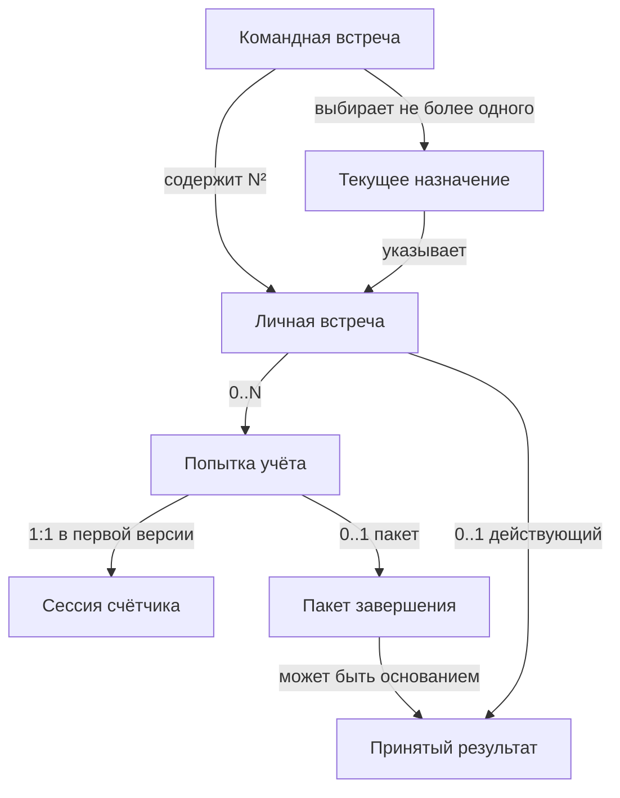
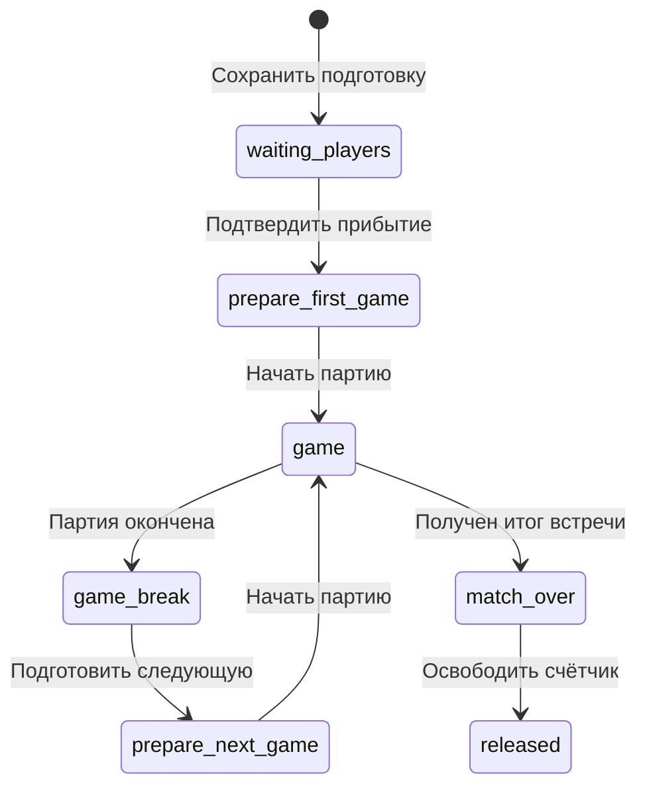

# Предметная модель нового ttScore: понятия, имена, состояния и архитектурные уточнения

Версия: **1.0.0-draft.1**. Дата: **2026-09-19**.

Статус: проектное основание для реализации. Модель разработана и проверена аналитически по предоставленному RC8 и архитектурному черновику. Исполняемое приложение, миграция данных и полевые испытания в эту работу не входят. Принятие документа владельцем не предполагается состоявшимся.

Результат: сохранены возможности ttScore Suite, уточнены предметные различия, выбраны локальные имена и сформулированы изменения архитектурного предложения. Название будущего продукта пока не выбирается; `ttScore Next` из прежнего документа остаётся рабочим обозначением.

## 1. Назначение и границы

**Назначение модели:** дать разработчику однозначные ответы о том, какую встречу ведут, кто и что может изменить, какой счёт следует показать, когда результат засчитан и как продолжить после прерывания.

Область: командная встреча 2×2, 3×3 или 4×4 с последовательным проведением личных встреч; самостоятельная личная встреча; Administrator, Umpire и зрители; подготовка, счёт, отчёты, Live, завершение, восстановление и Undo.

Функциональный ориентир — предоставленный `ttscore_suite_0.4.0-rc.8(1).zip`: ttScore 0.10.0 и ttscore_team 0.13.0. Источники и точные байты указаны в §14. Это модель эквивалентного нового приложения, а не описание уже реализованного внутреннего устройства RC8.

Модель не вводит турнир, несколько столов внутри одной командной встречи, парные встречи, электронные подписи, кадровый учёт судей, автоматическое начало игры, Pause Live в Team или автоматический перенос активного счётчика между устройствами. Статический архив Team, импорт и экспорт, защищённые отчёты, графики, озвучивание и ручное управление standalone Live сохраняются по функциональному контракту исходной архитектуры.

Документ дополняет `ttscore_successor_architecture_1.0.0-draft.1.md`. Для продолжения проектирования определения и уточнения §12 имеют приоритет над соответствующими формулировками его §8–14. Остальные решения исходного предложения остаются проектной основой. Исходный файл не изменён.

## 2. Как применены паттерны

Паттерны использованы для конкретных вопросов. Ссылки на связанные паттерны внутри источника сами по себе не означают, что все они применены или что выполнена полная формальная проверка соответствия FPF.

| Источник и паттерн | Почему применим | Полученный результат |
|---|---|---|
| Semantic Integration Engineering DPF, **SIE.3 — Construct or Reuse a Semantic Model for a Named Use** | Счётчик, Team и отчёт употребляют похожие слова для разных фактов | Вопросы и контрпримеры §3; определения §4; условия применимости модели |
| Operations Management DPF, **OPS.3 — Distinguish Operating Subjects, Cases, Queues, Resources, and Records** | Строка расписания, текущая встреча, попытка учёта и запись результата могут ошибочно считаться одним объектом | Идентичность и отношения §4–5; предметы работы и записи §8 |
| Там же, **OPS.4 — Maintain Shared Attention to Current Subject State** | Administrator, Umpire и зритель видят разные проекции и разную свежесть | Матрица представлений, источников и следующего действия §8 |
| Там же, **OPS.5 — Admit Work and Limit Starts** | Выбранная пара ещё не означает разрешение конкретному счётчику публиковать данные или начало партии | Условия допуска §8.2, один текущий связанный автор, явное начало партии |
| Там же, **OPS.6 — Continue Cases and Handle Exceptions** | Обрыв, потеря подтверждения и Team Undo меняют допустимое продолжение | Контракты восстановления §9; условия остановки и повторного действия |
| FPF Core, **F.8 — Mint-or-Reuse Decision** | Новое имя нужно не каждому полю и не каждой фразе | Повторное использование достаточных имён, ограниченные переименования §6 |
| FPF Core, **F.18 — Local-First Unification Naming Protocol** | Имена будут повторяться в модели, коде и контрактах | Локальные решения с Tech/Plain, альтернативами, причинами и условиями пересмотра §6 |
| FPF Core, **F.14 — Anti-Explosion Control for System-Role and Status Name Families** | Есть риск породить отдельные роли и классы для каждого режима и статуса | Статус, право записи, роль человека и состояние связи разделены без новых универсальных классов |
| FPF Core, **F.13 — Lexical Continuity & Deprecation** | Часть имён черновика уточняется, а старые схемы должны читаться | Таблица перехода имён §6.4; сохранение внешних форматов в адаптерах |
| Systems Engineering DPF, **SYSE.5 — Develop Functional Organization and Bearer Alternatives** | Предметные различия могут потребовать иной границы модулей и размещения функций | Сравнение распределений функций §11 |
| Там же, **SYSE.6 — Decide and Reopen the Engineering Architecture** | Нужно решить, какие прежние решения сохранить и что уточнить | Решение, ограничения, открытые проверки и условия пересмотра §11–12 |

Прочитаны условия применения и разделы решения перечисленных предметных паттернов; SIE.3 также проверен по результату, примерам и ограничениям. Для именования изучены положения F.8/F.18 о минимальном достаточном результате, сравнении кандидатов и локальном закреплении, а также соответствующие ограничения F.13/F.14. **F.5** оставлен вспомогательным ориентиром для различения роли, назначения и права: формальную систему U-kind и SystemRoleKindDescription для приложения не создаём. **E.10** — навигационный источник лексических уточнений, а не дополнительный процесс разработки.

OPS.6 не задаёт универсальный жизненный цикл: спортивные переходы ниже восстановлены из RC8 и проектного контракта. SIE.3 не предписывает графовую БД или OWL: для текущих вопросов достаточно определений, связей, таблиц и контрпримеров.

## 3. Вопросы, на которых квалифицирована модель

Повторно использованы различия из архитектуры: спортивный результат/представление, локальная фиксация/облачное принятие, назначение/попытка/автор. Обнаруженные пробелы: неоднозначность `Assignment` и `IndividualSlot`, отсутствие явной оси допуска, неполное описание отменённого принятия и недостаточное различение результата, квитанции и ссылки. Новая модель уточняет эти места; она не заменяет все понятия ради нового словаря.

| ID | Вопрос и пример | Ответ модели | Контрпример, который нельзя принять |
|---|---|---|---|
| Q01 | Что означает текущая личная встреча? | Она выбрана Team для проведения; её спортивная фаза может быть неизвестна | `current` доказывает, что спортсмены прибыли или играют |
| Q02 | Что происходит при решающем 12:10 после 2:2? | Итог 3:2, удерживаемое табло 2:2 / 12:10; Team +1 только после принятия | Прибавить Team три победы либо принять 2:2 за итог |
| Q03 | Что значит пустой индикатор? | Для известной фазы цифры намеренно не показываются | Подставить 0:0 при отсутствии данных |
| Q04 | Совпадают ли две попытки с той же парой и счётом? | Только если совпадает их явная идентичность | Считать одинаковые фамилии, время или 3:2 доказательством тождества |
| Q05 | Что изменилось после смены сторон? | Физическое/экранное расположение спортсменов | Очки A переходят команде B |
| Q06 | Освобождённый счётчик означает принятый итог? | Нет; показания и доставка независимы | Очистить пакет передачи вместе с табло |
| Q07 | Кто может изменить Team после Team Undo? | Только автор с действующим назначением и регистрацией | Старый пакет подходит новой попытке, поскольку счёт равен |
| Q08 | Можно ли снова начать встречу после reload? | Сначала восстановить сохранённую сессию и проверить допуск; reload сам по себе ничего не перезапускает | Создать новую попытку при каждом открытии |
| Q09 | Можно ли засчитать ручной результат без отчёта? | Да, через проверяемую команду Administrator | Создать вымышленные розыгрыши для полноты отчёта |
| Q10 | Потерян ответ сервера: принят ли результат? | Пока неизвестно; выясняется по идентичной команде и квитанции | Считать тайм-аут отказом либо повторить с новым идентификатором |
| Q11 | Разрешает ли вход в аккаунт записывать текущую встречу? | Только вместе с действующим допуском к этой попытке | Авторизация пользователя доказывает назначение судьи или право любого счётчика |
| Q12 | Сетевая ошибка означает перерыв в игре? | Нет; локальный спортивный процесс и связь независимы | Перевести `game` в `game_break` из-за обрыва |
| Q13 | Завершилась ли Team при исчерпании пар? | Да; возможна ничья 2:2 или 8:8, либо ранее достигнут порог побед | Требовать победителя во всех форматах |
| Q14 | Что доказывает отчёт? | Содержимое записанного учёта определённой встречи/попытки | Наличие файла доказывает физическое проведение всех розыгрышей |

Ответы проверены аналитически. Подтверждение удобства терминов реальными участниками и исполняемая проверка ещё нужны; они не подменены настоящей таблицей.

## 4. Предметная модель

### 4.1. Сущности, записи и значения

Идентификаторы — непрозрачные значения; фамилия, экранный номер и URL не являются идентичностью. Область уникальности каждого ID указана ниже. A/B в командной встрече — постоянные стороны команд; left/right — расположение в конкретном представлении.

| ID | Понятие и техническое имя | Определение и идентичность | Существенные отношения |
|---|---|---|---|
| M01 | Командная встреча — `TeamMatch` | Единица проведения встреч двух составов по заданному формату. `teamMatchId` уникален в новом контуре | Два состава, N² личных встреч, порядок, действующие результаты |
| M02 | Спортсмен — `Athlete` | Участник конкретного состава/самостоятельной встречи. Локальный `athleteId`; глобальный реестр людей не вводится | В Team: принадлежность стороне A или B. Одинаковые фамилии допустимы |
| M03 | Личная встреча — `IndividualMatch` | Предусмотренная или проводимая встреча двух спортсменов по одному формату. В Team: `(teamMatchId, individualMatchId)` | Устойчивый предмет расписания; может иметь несколько попыток учёта, не более одного действующего принятого результата |
| M04 | Текущее назначение — `CurrentAssignment` | Выбор одной M03 для текущего проведения с фиксированными существенными условиями. `(teamMatchId, assignmentGeneration)` и ссылка на M03 | Не назначение человека судьёй; не начало игры; следующая генерация отзывает прежнюю |
| M05 | Попытка учёта — `MatchAttempt` | Один отдельно идентифицированный учёт личной встречи. `attemptId` создаётся один раз; повтор запроса его не меняет | Относится к M03; повторная попытка учёта не доказывает физическую переигровку |
| M06 | Сессия счётчика — `CounterSession` | Восстанавливаемое локальное состояние работы счётчика: настройки, M05, партии, розыгрыши, показания. `sessionId` | В первой реализации одна сессия ↔ одна попытка; reload сохраняет обе identity; вкладка не является сессией |
| M07 | Регистрация автора — `WriterRegistration` | Техническая запись допуска конкретного автора к M05 под M04, с `attemptEpoch`, `writerEpoch`, `writerId` | Не кадровое назначение Umpire; права облачной записи проверяются отдельно |
| M08 | Партия — `Game` | Часть учёта личной встречи с начальными условиями и последовательностью розыгрышей. `(attemptId, gameId)` | Имеет начальную подачу/фору, записанные розыгрыши и вычисленный итог |
| M09 | Запись розыгрыша — `RallyRecord` | Утверждение Umpire о присуждённом очке. `(attemptId, gameId, rallyNumber)` внутри редакции учёта | Победитель, подающий, счёт после; запись отлична от физического события |
| M10 | Спортивный итог — `MatchResult` | Вычисленное значение победителя и партий завершённой M05 | Включает последнюю партию сразу после решающего очка; ещё не командное принятие |
| M11 | Показания счётчика — `CounterView` | Проекция фазы и спортивного учёта для одной ориентации экрана | Может удерживать предыдущий счёт партий и скрывать цифры; не второй спортивный счёт |
| M12 | Пакет завершения — `CompletionEnvelope` | Неизменяемая запись подтверждённого намерения передать конкретный итог, с точными байтами отчёта. `finalizationId` | Ссылка на M05, binding, sportRevision, result, reportHash; создан локально до сети |
| M13 | Принятый результат — `AcceptedResult` | Запись командного решения о зачёте результата конкретной M03. `acceptedResultId` | Содержит значение M10 либо проверенный ручной итог; происхождение `automatic`/`manual`; может быть отменён |
| M14 | Квитанция операции — `CommandReceipt` | Исторический ответ на конкретную команду. Ключ `(teamMatchId, commandId)` | payloadHash, эффект, teamRevision, acceptedResultId при принятии; не сама победа |
| M15 | Отчёт — `ReportArtifact` | Зафиксированное содержимое отчёта об учёте M05 с форматом и хешем | Канонический JSON и производные HTML/защищённый файл; местоположение отдельно |
| M16 | Публикация Live — `LivePublication` | Технический канал показа определённой M05 с явной identity и редакциями снимков | Может прерваться; не создаёт и не завершает спортивную встречу |
| M17 | Выбор текущего источника — `CurrentLiveSelection` | Ссылка постоянной Team-страницы на допустимый источник текущего назначения | Нет подтверждённого источника → ожидание; собственный и внешний источники различаются |

Для standalone M03 получает самостоятельный `individualMatchId`; командной привязки нет. Athlete ID задаётся в области этой встречи. В первой версии не создаём отдельный каталог M03 для standalone: её identity и определение сохраняются в сессии. Отдельные физическое событие, запись, идентификатор и носитель различаются по смыслу, но не требуют четырёх таблиц.

`RallyRecord` сохраняет последовательную нумерацию в текущей редакции. Undo удаляет последнюю запись из действующего учёта; последующее очко может снова получить тот же номер. Поэтому для дедупликации команды служит `commandId`, а для различения версий записи — `localRevision`; номер розыгрыша не является глобальным ID события.

Состав Team — список ссылок на спортсменов с названиями команд. Отдельная постоянная сущность клуба или команды вне данной встречи не нужна. Порядок личных встреч — отношение, а не часть их ID.

### 4.2. Связи и кратности



Диаграмма показывает отношения модели, не последовательность вызовов. Ручное принятие создаёт M13 без M12. Отменённые M13 сохраняются как история, но не попадают в кратность действующих результатов.

### 4.3. Источники утверждений и границы их силы

| Утверждение | Основание в приложении | Чего основание не доказывает |
|---|---|---|
| Розыгрыш присуждён спортсмену | Действие Umpire, сохранённое в текущем учёте | Независимое наблюдение физического розыгрыша |
| Локальный итог равен 3:2 | Правила и сохранённые партии данной попытки | Принятие Team |
| Результат засчитан Team | Действующий AcceptedResult и связанная квитанция | Наличие подробного отчёта при ручном вводе |
| Счётчик был подготовлен | Сохранённая фаза и её identity | Прибытие спортсменов до отдельного подтверждения |
| Автор допущен к записи | Действующая регистрация и техническая авторизация | Личность, квалификация и физическое присутствие судьи |
| Зритель получил снимок | Данные подписки с подходящей identity/revision | Что более нового снимка сейчас нигде нет |

## 5. Идентичность, редакции и неизменяемые условия

### 5.1. Привязка

Связанная сессия хранит:

```text
TeamBinding = {
  teamMatchId, individualMatchId, assignmentGeneration,
  attemptId, attemptEpoch, writerEpoch
}
```

`writerId` в регистрации обозначает технического автора; авторизационные данные проверяются отдельно. `sessionId` нужен для локального восстановления. Общее значение фамилий, счёта, времени создания или URL не заменяет ни одного поля binding.

До облачной регистрации существует только сохранённое намерение привязаться с известной частью identity. Оно не является подтверждённым TeamBinding и не разрешает публикацию. Потеря сети у ранее зарегистрированной сессии означает невозможность проверить актуальность допуска, а не автоматический отзыв или превращение в standalone.

### 5.2. Порядок изменений

| Поле | Область | Когда меняется | Когда не меняется |
|---|---|---|---|
| `assignmentGeneration` | Вся Team | Переход на следующую M03, Team Undo, существенное изменение текущего назначения | Смена экранных сторон, правка независимой ссылки |
| `attemptEpoch` | Назначение | Явная регистрация новой попытки | Retry той же регистрации, reload |
| `writerEpoch` | Регистрация текущей попытки | Явное замещение пишущего автора при разрешённом восстановлении | Обрыв, переподписка, истечение локального тайм-аута |
| `teamRevision` | TeamControl | Успешная управляющая транзакция | Неуспешная команда; повтор с существующей квитанцией |
| `localRevision` | Сессия | Каждый commit, в том числе Undo и освобождение | Изменение лишь несохранённой копии в памяти |
| `sportRevision` | Сессия | Изменение очков или определяющих их условий | Только смена вида/ориентации/освобождение |
| `presentationRevision` | Сессия | Изменение фазы или показаний | Повтор команды без эффекта |

Поколения и ревизии не сравниваются между разными областями. Они монотонны внутри своей области и не основаны на часах устройства. Undo возвращает прежнее содержание с новой редакцией. `updatedAt` используется для сообщения человеку и оценки давности, но не выбирает победителя гонки.

В текущей версии смена устройства не обещает бесшовного продолжения: новая эпоха отзывает прежнего автора, но восстановление спортивного учёта требует отдельно проверенного источника. Если такого источника нет, допустим ручной итог или новая явно начатая попытка; чужое состояние не угадывается.

### 5.3. Изменяемость и история

Имена спортсменов и реквизиты можно исправлять в разрешённых RC8 границах. ID спортсменов и встреч при исправлении написания сохраняются. Пакет завершения и опубликованный резервный отчёт после фиксации не переписываются под новые имена: они сохраняют снимок исходных условий.

Правка существенных условий текущего назначения должна отозвать прежнюю привязку через новую генерацию. Правка ссылки отчёта не меняет спортивного результата. После завершения Team сохраняется разрешённое редактирование ссылок; произвольное изменение прошедшего счёта выполняется только через предусмотренный Team Undo и новое принятие.

### 5.4. Режимы источника Team и ссылки

Облачный связанный сценарий §7–9 использует TeamControl, регистрацию и квитанции. Локальное создание/редактирование Team JSON использует те же чистые проверки составов, порядка, ручного результата и Undo, но изменяет выбранный локальный документ. Сохранение файла не является облачным принятием и не даёт права на автоматическую Team/Live-публикацию. Статический архив остаётся только для чтения. Публикация подготовленной Team — отдельный сценарий; импорт файла не включает его автоматически.

`ReportLink` — редактируемое значение адреса при конкретной личной встрече, не ещё одна сущность с собственной историей спортивных результатов. `reportHash` идентифицирует содержимое в оговорённом формате, URL — место доступа. Наличие URL само по себе не подтверждает ни содержимое, ни его соответствие текущей попытке.

## 6. Выбор имён

### 6.1. Локальная схема именования

Схема относится только к этому проекту и редакции модели. Русские пользовательские термины: **встреча**, **спортсмен**, **партия**, **розыгрыш**, **протокол** для текстового представления, **Undo**, **Umpire**. В коде английское `Match` допустимо в квалифицированном имени: оно не меняет русский термин на «матч».

Правила:

- Типы — существительные: `TeamMatch`, `CounterSession`, `CommandReceipt`.
- Команды — действие и предмет: `ConfirmCompletion`, `AcceptResult`, `UndoLastAcceptedResult`.
- Факты совершённого действия — прошедшая форма: `ResultAccepted`, `AssignmentChanged`. Эти имена не обязывают вводить event sourcing.
- Статус имеет хозяина: `completionDelivery.state`, `liveConnection.state`. Общего поля `status` для всех измерений нет.
- `id` идентифицирует, `revision` упорядочивает изменения одного объекта, `epoch` отсекает прежнего автора/попытку, `url` задаёт местоположение.
- Слово «сессия» всегда уточняется как сессия счётчика; оно не означает вкладку, вход в аккаунт или сетевое соединение.
- UI не обязан показывать технические имена, эпохи и идентификаторы вне диагностики конфликта.

### 6.2. Минимальные локальные карточки решений

Ниже — практическая адаптация F.18, а не заявление о регистрации терминов в FPF Core. Общее основание каждой карточки: определения Mxx в §4, схема §6.1, область — документация и внутренние контракты нового приложения. Выбранные Tech и Plain обозначают один предмет. Полная причина выбора и отклонённые варианты входят в строку; отдельные файлы карточек не нужны.

| Карточка / предмет | Tech / Plain | Рассмотренные альтернативы и решение | Условие пересмотра |
|---|---|---|---|
| N01 / M01 | `TeamMatch` / Командная встреча | Сохранить. `TeamEncounter` возможен, но не даёт дополнительного различия; `TeamEvent` смешивает встречу с мероприятием | Появится турнир/мероприятие, которое реально конфликтует с этим смыслом |
| N02 / M03 | `IndividualMatch` / Личная встреча | Вместо `IndividualSlot`. `Fixture` подчёркивает расписание, но хуже охватывает standalone; `Slot` может означать позицию, время или место, хотя ID встречи сохраняется при перестановке | Поддержка парных встреч или отдельного временного слота потребует новой границы |
| N03 / M04 | `CurrentAssignment` / Текущее назначение встречи | Уточнить `Assignment`. `UmpireAssignment` неверно: человека здесь не назначают. `CurrentSelection` недостаточно отражает условия и их поколение; `ScheduleEntry` не выделяет текущий допуск | Возникнут несколько одновременно текущих встреч/столов |
| N04 / M05 | `MatchAttempt` / Попытка учёта | `Replay` ошибочно утверждает переигровку; `MatchRun` смешивает спортивное проведение и запуск программы. Голое `Attempt` слишком широко | Появится отдельная модель санкционированной спортивной переигровки |
| N05 / M06 | `CounterSession` / Сессия счётчика | Вместо `PersonalSession`. `BrowserSession` ошибочно связывает identity со вкладкой; `MatchRecord` обозначает запись, но не весь рабочий контекст | Одна сессия станет содержать несколько попыток или переноситься между устройствами |
| N06 / M07 | `WriterRegistration` / Регистрация автора записи | Вместо `AttemptRegistration`: содержит ещё допуск автора и его эпоху. `UmpireRole` смешивает человека с техническим правом; `Lease` обещает срок действия, которого модель не задаёт | Появится реальная аренда с временем истечения или несколько совместных авторов |
| N07 / M09 | `RallyRecord` / Запись розыгрыша | `Rally` без уточнения может обозначать физическое событие; `PointEvent` смешивает присуждённое очко с форой и техническим событием | Появится независимый источник событий физической игры |
| N08 / M10 | `MatchResult` / Спортивный итог личной встречи | `Score` без квалификатора неоднозначен; `FinalScore` не говорит, личный это счёт или командный. `Outcome` слишком широко | Включение отказа, дисквалификации или иных неспортивных оснований завершения |
| N09 / M12 | `CompletionEnvelope` / Пакет завершения | Сохранить. `PendingResult` неверен после принятия; `Report` не содержит смысл команды; `CompletionRequest` хуже подчёркивает зафиксированные байты | Изменится граница атомарного сохранения или формат нескольких результатов |
| N10 / M13 | `AcceptedResult` / Засчитанный результат личной встречи | Сохранить. `ApprovedResult` намекает на дополнительное одобрение Administrator; `TeamScore` обозначает агрегат, а не один зачёт | Появится обязательное отдельное судейское утверждение результата |
| N11 / M14 | `CommandReceipt` / Подтверждение операции | Вместо `ResultReceipt`, поскольку подтверждаются также Undo и регистрация; `Acknowledgement` может означать лишь транспортное получение | Разделение транспортной квитанции и предметной квитанции потребует уточнения |
| N12 / M17 | `CurrentLiveSelection` / Текущий источник трансляции | `LiveUrl` — только адрес; `LiveSession` дублирует сессию счётчика; `Selector` без предмета слишком общий | Несколько источников для одной текущей встречи |

Этого набора достаточно для спорных долговечных имён. Для обычных подписей «Звук», «Место», «Дата» карточки не создаются. `Administrator` и `Umpire` сохраняются; роли `OfflineUmpire`, `FinishedUmpire`, `RetryingWriter` не вводятся. Переводы и псевдонимы не являются новыми сущностями.

### 6.3. Счёт, состояние и названия действий

| Значение / команда | Имя в коде | Пользовательское выражение |
|---|---|---|
| Очки текущей партии | `gamePoints` | Очки |
| Все выигранные партии по спортивному учёту | `gamesWon` | Счёт по партиям |
| Показываемые очки / партии | `displayedGamePoints`, `displayedGamesWon` | Цифры на табло; подписи выбираются по экрану |
| Число зачтённых личных побед | `teamWins` | Командный счёт |
| Подготовить и сохранить сессию | `PrepareCounterSession` | Подготовить встречу |
| Подтвердить прибытие спортсменов | `ConfirmAthletesPresent` | Спортсмены прибыли |
| Начать подготовленную партию | `StartGame` | Начать партию |
| Записать присуждённое очко | `RecordRallyWinner` | Нажатие зоны спортсмена |
| Подготовить следующую партию | `PrepareNextGame` | Подготовить следующую партию |
| Скрыть индикаторы после финала | `ReleaseCounter` | Освободить счётчик |
| Зафиксировать итог для передачи | `ConfirmCompletion` | Подтвердить завершение |
| Засчитать проверенный пакет | `AcceptResult` | Автоматическое действие; «Результат принят» после квитанции |
| Внести итог вручную | `RecordManualResult` | Внести результат |
| Отменить локальный шаг | `UndoCounterAction` | Undo на счётчике |
| Отменить последний действующий командный зачёт | `UndoLastAcceptedResult` | Undo в Team |

Это выбранный словарь, не готовый макет интерфейса. При объединении освобождения и подтверждения в одну кнопку её подпись должна явно сообщать оба действия; внутренние намерения и гарантии остаются раздельными.

### 6.4. Преемственность

| Имя в архитектурном draft.1 | Новое имя | Характер изменения |
|---|---|---|
| `IndividualSlot`, `slotId` | `IndividualMatch`, `individualMatchId` | Уточнение предмета: identity встречи не зависит от места в порядке |
| `Assignment`, `generation` | `CurrentAssignment`, `assignmentGeneration` | Уточнение владельца и области генерации |
| `PersonalSession` | `CounterSession` | Уточнение вида сессии |
| `AttemptRegistration` | `WriterRegistration` | Явное отражение допуска автора; поля попытки сохраняются |
| `Rally` в записи данных | `RallyRecord` | Различение физического события и записи |
| `ResultReceipt` | `CommandReceipt` | Обобщение квитанции до её действительной области |
| `teamId` | `teamMatchId` | Устранение смешения команды и командной встречи |
| `CounterPresentation` | Без переименования | Сохраняемое состояние представления; `CounterView` — вычисленная проекция |

Внешние ключи RC8 (`playerAId`, `individualMatchId`, `assignmentGeneration`, `ttScoreMatchId` и другие) не переименовываются заменой текста. Адаптер учитывает конкретную версию схемы и смысл поля. `ttScoreMatchId` нельзя автоматически объявить новым `attemptId` без проверки соответствия. Активные legacy-привязки и pending не переносятся. Старые названия остаются в источниках и карте соответствий; исторические отчёты не переписываются.

## 7. Состояния и переходы

### 7.1. Независимые измерения

| Измерение | Значения в новой модели | Что изменяет |
|---|---|---|
| Положение личной встречи в Team | `planned`, `current`, `finished`; `not_required` — вычисленное представление | Выбор/зачёт/Team Undo |
| Фаза счётчика | Семь фаз из §7.2 | Действие Umpire и спортивный итог |
| Допуск связанной попытки | `pending`, `admitted`, `revoked`, `conflict`; для standalone — не применяется | Регистрация и сверка актуального назначения |
| Фиксация завершения | `editable`, `confirmed` | В Team — commit CompletionEnvelope; в standalone — локальная фиксация итога |
| Доставка подтверждённого пакета | `backup_pending`, `accept_pending`, `accepted`, `conflict`, `accepted_then_undone`, `resolved_without_acceptance` | Сетевые подтверждения, сверка, явное разрешение |
| Состояние каждого канала связи | `idle`, `connecting`, `current`, `interrupted`, `expired`, `error` | Наблюдения соответствующего адаптера |
| Сохранность локальных данных | `committed`, `volatile` | Результат локальной транзакции |

Допуск и состояние связи независимы: при `interrupted` последнее известное `admitted` не является доказательством текущего права облачной записи. К нему сохраняются источник/редакция последней проверки. Перед новым облачным эффектом серверная граница проверяет актуальный binding.

`confirmed` не означает `accepted`. `accepted_then_undone` — исторический успех, чей спортивный эффект отменён. `resolved_without_acceptance` — явное закрытие старой передачи после сохранения её материалов; это не скрытый успешный зачёт.

Отдельный `intent_saved` из draft.1 исключён как долговременное состояние доставки: успешный commit сразу даёт `confirmed + backup_pending`. Краткое состояние подготовки байтов существует только внутри команды до commit и не разрешает сеть.

### 7.2. Фазы счётчика и видимые показания

Для внутреннего enum сохраняются имена RC8: они однозначны внутри `CounterPhase`. Вариант `match_over` означает окончание спортивной игры данной попытки, а не командное принятие.

| Фаза | Отображаемые очки | Отображаемые партии | Допустимое основное действие |
|---|---|---|---|
| `waiting_players` | Пусто | Пусто | Подтвердить прибытие |
| `prepare_first_game` | Пусто | 0:0 | Начать первую партию |
| `game` | Текущие очки, включая начальную фору | Завершённые партии | Записать очко, допустимый Undo |
| `game_break` | Финальные очки завершённой партии | Без только что завершённой партии | Подготовить следующую |
| `prepare_next_game` | Пусто | Все завершённые партии | Начать следующую |
| `match_over` | Финальные очки последней партии | Без последней партии | Коррекция до подтверждения; освободить; подтвердить завершение |
| `released` | Пусто | Пусто | Подтвердить завершение либо наблюдать/восстановить передачу |

При неизвестной фазе таблица не применяется: показывается отсутствие подтверждённых данных. На языке значений известная пустота — `null` внутри известного CounterView; неизвестность — отдельное качество данных. Ноль — действительное значение счёта. Индикатор подачи допустим только для текущей игры.



Диаграмма показывает обычный ход. Undo до подтверждения возвращает предыдущее доступное состояние, включая обратный переход из `released` или `match_over`; при этом редакции растут. После подтверждения спортивный Undo закрыт. `ReleaseCounter` после подтверждения всё ещё разрешён и не меняет замороженный пакет. Новая встреча создаёт новую сессию, а не возвращает старую в начальную фазу.

### 7.3. Контракт переходов

| Команда / факт | Предусловия | Атомарный результат и подтверждение | Недопустимое следствие |
|---|---|---|---|
| `PrepareCounterSession` | Настройки валидны; локальный контекст свободен; прежняя передача разрешена | Сессия, attemptId, настройка, `waiting_players`, намерение регистрации сохранены | Автоматическое начало партии |
| `ConfirmAthletesPresent` | `waiting_players`, допустимый автор локальной сессии | `prepare_first_game`, снимок для Undo | Утверждение прибытия из одного открытия страницы |
| `StartGame` | Подготовлена первая/следующая партия | `game`, начальные очки, подача, сохранённая редакция | Повтор команды повторно начинает/обнуляет партию |
| `RecordRallyWinner` | `game`, нет подтверждённого пакета | Запись очка и единый пересчёт SCORE; FLOW получает обычную игру, перерыв или финал | Team получает отдельную победу за партию |
| `PrepareNextGame` | `game_break`, встреча не окончена | Учёт предыдущей партии в табло, смена сторон ровно один раз, новая подготовка | Смена сторон при каждом retry |
| `ReleaseCounter` | `match_over` либо уже `released` | Скрыты индикаторы; повтор без эффекта | Потеря итога, отчёта, binding или pending |
| `ConfirmCompletion` в Team | Есть допустимый окончательный итог, фаза `match_over`/`released`, сохранён полный binding с регистрацией, локальная запись возможна | В одной транзакции сессия и неизменяемый пакет; `confirmed` | Сеть раньше commit, изменение пакета при retry |
| `AcceptResult` | Подтверждённый backup, действующая identity, нет прежнего эффекта команды | AcceptedResult + receipt + следующий current/итог Team + новая генерация | Частично изменённая очередь при незаписанном результате |
| `RecordManualResult` | Administrator управляет актуальной Team; текущая встреча, допустимый итог bestOf | То же командное изменение с `sourceKind=manual`; отчёт необязателен | Фиктивная история розыгрышей |
| `UndoLastAcceptedResult` | Последний действующий результат совпадает с ожидаемым ID и ревизией | Отмена зачёта, восстановленный current, прежний current → planned, новая генерация, квитанция | Возврат прежнего права записи старой попытке |

Если связанная попытка всё ещё ожидает первой регистрации и её epochs неизвестны, ConfirmCompletion пока недоступна: итог сохраняется, счётчик можно освободить, а пакет создаётся после получения и локального сохранения полной регистрации. Иначе пришлось бы менять identity уже замороженного пакета. При временном обрыве после состоявшейся регистрации пакет с сохранённым полным binding можно зафиксировать локально; актуальность этого binding снова проверяется при облачном принятии.

Для локальных команд успех означает завершение транзакции, не только обработчик кнопки. Для Team — подтверждённую управляющую транзакцию или возвращённую её квитанцию. Счёт в памяти при отказе хранения допускается только как явно `volatile`; это не новый committed результат.

### 7.4. Спортивные и командные инварианты

1. В Team ровно N² уникальных межкомандных пар для N ∈ {2,3,4}; перемещение строки не меняет её ID. Завершённые встречи образуют префикс порядка, затем не более одной current и оставшиеся planned.
2. BestOf ∈ {3,5,7}; победитель имеет `(bestOf+1)/2` партий, проигравший меньше. Итог личной встречи не бывает ничейным в данном профиле.
3. В профиле RC8 партия заканчивается при не менее 11 очках и преимуществе не менее двух. Фора 1–10 — начальные очки, не выигранные розыгрыши. Специальные правила подачи/смены сторон с форой наследуются из профиля RC8, а не объявляются нормативными правилами всего ITTF.
4. `teamWins(side)` равно количеству действующих AcceptedResult с соответствующим победителем. Квитанции и отменённые результаты не суммируются.
5. Порог побед Team: `floor(N²/2)+1`, то есть 3, 5 или 9. При достижении порога остаток показывается как `not_required`, current отсутствует. При исчерпании всех пар без порога возможна ничья 2:2 или 8:8.
6. У каждой M03 не более одного действующего AcceptedResult. Ручное и автоматическое принятие конкурируют за одну транзакционную границу.
7. Личные A/B устойчивы; для Team они соответствуют сторонам команд. Перестановка экрана меняет представление, а не принадлежность очков.
8. До ConfirmCompletion доступны до 50 локальных шагов Undo в памяти и один сохранённый шаг после reload — поведение RC8. Подтверждённый пакет не редактируется.
9. Старые локальные сессии могут сохраниться после отзыва допуска; наличие их файлов не означает несколько разрешённых текущих авторов.

## 8. Работа ролей: предмет, допуск и общая картина

### 8.1. Что является работой и её записью

Предмет работы Umpire — проведение учёта выбранной личной встречи. Подготовка, ввод присуждённых очков и подтверждение итога — действия. Сессия, фаза и отчёт — записи об этой работе. Предмет работы Administrator — составы, порядок, текущая встреча, принятые результаты и разрешение конфликтов. Строка расписания не является спортсменом, судьёй или выполненной работой.

Очередь здесь — упорядоченные ещё не завершённые личные встречи данной Team. Приложение поддерживает установленный порядок и явную перестановку planned; не вводит оптимизацию очередей или универсальную модель ресурсов. Судья, устройство и подключение различаются; доступ к приложению не доказывает готовность спортсменов.

| Участник / решение | Что должен видеть | Источник и предел актуальности | Следующее действие |
|---|---|---|---|
| Administrator: кого проводить сейчас | Team-счёт, текущая M03, принятая регистрация/последняя подтверждённая фаза, состояние связи | TeamControl; данные Live относятся только к совпадающей identity | Проверить текущую пару; штатно ждать действий Umpire |
| Umpire: можно ли начать партию | Пара, настройки, текущая фаза, сохранность, последнее известное состояние допуска | Локальная сессия + отдельно облачная регистрация | Подготовить/начать партию вручную |
| Umpire: что делать после финала | Итог, удерживаемые цифры, доступность Undo, подтверждение и доставка | Локальный committed снимок и пакет; квитанция для принятия | Исправить до подтверждения либо подтвердить завершение |
| Administrator: принят ли результат | AcceptedResult, его происхождение, ссылка при наличии, конфликтующие сведения | Управляющая транзакция, не наличие отчёта или Live URL | Продолжить либо выполнить явное восстановление |
| Зритель: что сейчас показывают | Текущая пара, подходящие показания, ожидание/обрыв/устаревание | CurrentLiveSelection + снимок этой identity | Только наблюдать; нет права записи |
| Новый оператор после reload | Восстановленная сессия, актуальность допуска, pending/receipt, доступный Undo | Локальные записи со сверкой облачных фактов | Восстановить или разрешить конкретный конфликт |

Свежесть — свойство конкретного утверждения для конкретного действия. Новая дата получения старого снимка не делает старую попытку текущей. Численные интервалы индикации устаревания остаются настройкой будущего транспортного контракта; они не определяют спортивную фазу и не дают права записи.

### 8.2. Допуск и ограничения начала

Разделяются три решения:

- Team выбирает текущую M03 и её условия.
- Техническая регистрация допускает конкретную попытку/автора к облачной записи.
- Umpire подтверждает прибытие и вручную начинает подготовленную партию.

Штатная регистрация автоматическая; дополнительного одобрения Administrator после каждого подтверждения Umpire нет.

| Ситуация | Решение по допуску | Что можно сейчас | Условие продолжения |
|---|---|---|---|
| Сохранённая сессия совпадает с current; автор свободен и авторизован | `admitted` после регистрации | Публиковать сохранённые снимки; вести счёт по фазе | Новый generation/epoch требует повторной сверки |
| Назначение известно, сети для регистрации нет | `pending` | Вести локальный учёт в сохранённом контексте с явным отсутствием подтверждённого допуска | Успешная регистрация той же identity; до неё Team/Live-записей нет |
| Регистрация уже принадлежит другому автору | `conflict` | Просмотр, сохранение/экспорт локальных материалов | Явное разрешённое восстановление или сохранение действующего автора |
| Team перешла/выполнила Undo | `revoked` после подтверждённой сверки | Сохранить старый учёт, показать смену назначения | Отдельная подготовка нового назначения; без автопереноса pending |
| В профиле уже управляется другая Team | Начало второго контекста заблокировано | Читать публичные страницы | Явное освобождение/разрешение текущей работы и смена контекста |
| Есть неразрешённый пакет прежней встречи | Новая связанная подготовка отложена | Восстановить доставку или явно разрешить конфликт | Терминальный исход прежней передачи без потери её материалов |

Ограничения: одна управляющая Team-вкладка и один пишущий счётчик в одном origin/профиле; оба могут работать совместно для одной Team. Публичные страницы параллельны. Между устройствами актуальность автора устанавливает облачная граница, а не локальный lock. Новая самостоятельная сессия также не должна перезаписывать единственный неразрешённый пакет.

## 9. Продолжение и исключения

| Случай | Ответственный и допустимое действие | Подтверждение результата | Если условия не выполнены |
|---|---|---|---|
| Обычное завершение | Umpire подтверждает; SYNC сохраняет backup и вызывает AcceptResult | Локальный пакет, совпадающий backup, командная квитанция | Пакет остаётся; показывается конкретный этап ожидания |
| Обрыв в ходе игры | Umpire продолжает локально; адаптер пытается восстановить связь | Новые committed ревизии; после связи проверена identity и опубликован актуальный снимок | При отозванном допуске автоматические Team-записи прекращаются |
| Регистрация прошла, локальное сохранение ответа не прошло | SYNC повторяет тот же requestId/attemptId | Получена прежняя регистрация, сохранена локально | Не создаёт новый epoch только для обхода ошибки |
| Отказ локального хранения при счёте | Umpire видит несохранённые действия; может сохранить восстановительный экспорт | Успешный последующий commit того же актуального учёта | После закрытия страницы сохранность volatile-очков не гарантирована |
| Отказ при подготовке, фазе или ConfirmCompletion | STORE отклоняет переход | Сохранилось прежнее committed состояние | Публикация и принятие нового результата запрещены; повтор после восстановления записи |
| Backup записан, ответ потерян | SYNC повторяет тот же пакет с теми же байтами | Совпали identity, формат и hash; существующий объект признан тем же | Другие байты под тем же ID → конфликт, не перезапись |
| Team приняла, ответ потерян | SYNC повторяет тот же commandId/payloadHash | Возвращена историческая receipt | Не требует прежнего current: он законно сменился при принятии |
| Team Undo после принятия | Administrator отменяет последний зачёт; старый SYNC сверяет receipt и отмену | `accepted_then_undone`; командный счёт без отменённой победы | Повтор не восстанавливает результат |
| Team Undo до принятия старого пакета | SYNC получает несовпадение generation | `conflict`, старый пакет сохранён | Не адресует пакет новой текущей встрече |
| Ручной результат принят раньше автоматического | Administrator видит источники и identity; разрешает старую передачу | Действует ручной AcceptedResult; старая передача явно закрыта как не принятая | Равенство счёта не основание удалить пакет или автоматически связать отчёт |
| Reload с сохранённой встречей старше 120 секунд | Umpire выбирает восстановление; pending сначала предъявляется для разрешения | Та же sessionId/attemptId, доступен один допустимый Undo | «Новая встреча» не удаляет единственный неразрешённый результат |
| Смена назначения при старом открытом финале | Team-view переключается на ожидание нового источника; локальный финал сохраняется | Новый selection не содержит старого снимка | Нельзя показывать старые очки под новой парой |
| Изменена только ссылка отчёта | Administrator сохраняет проверенный адрес | teamRevision изменена, AcceptedResult и teamWins прежние | Ошибка адреса не откатывает спортивный результат |

Каждая строка задаёт ожидаемый контракт. Она не является отчётом об уже выполненном испытании.

### 9.1. Граница одного эффекта

Для ещё не применённой команды серверная граница проверяет текущую identity, допустимость итога, ожидаемую ревизию и основание backup. В одной Team-транзакции создаются принятый результат, следующий current или завершение Team, новая генерация, очищенный Live selection и квитанция.

Для ранее применённой команды сначала ищется receipt. При совпадении payloadHash возвращается исторический исход без нового эффекта; затем отдельно устанавливается, действует ли тот результат сейчас. При другом payloadHash — конфликт. Таким образом, потерянный ответ после перехода на следующую пару не превращается в ошибочный отказ прежнему корректному результату.

Это требование к реализуемому серверному контракту. Способ выразить все проверки в RTDB Rules/транзакциях должен быть доказан прототипом; локальный валидатор не является доверительной границей.

### 9.2. Когда случай завершён

Спортивная игра закончена при получении MatchResult. Работа с передачей закончена при `accepted`, `accepted_then_undone` либо явно оформленном `resolved_without_acceptance` с сохранёнными материалами. `conflict`, потеря ответа и освобождение индикаторов не закрывают передачу.

Для самостоятельной встречи Team-доставка отсутствует. Подтверждённый итог фиксируется локально для отчёта; собственный standalone Live управляется вручную по прежнему сценарию. Ни регистрация Team, ни Team receipt при этом не создаются.

## 10. Согласованные проекции

Рекомендуемая минимальная оболочка чтения:

```text
ObservedView<T> = {
  subjectIdentity,
  sourceRevision,
  receivedAt,
  quality: known | unknown | stale | conflict,
  value: T | null
}
```

Это проектный тип, не формат RC8. `receivedAt` — время получения, а не порядок спортивных событий. `known` означает известные данные указанной редакции, не абсолютную актуальность. Известная пустота отдельного индикатора находится внутри `value`; `quality=unknown` обозначает невозможность построить достоверное представление вообще.

Проекторы получают один согласованный снимок и его identity:

- **Counter projector:** применяет CounterPresentation к спортивным данным; в `game_break`/`match_over` исключает удерживаемую партию только из displayedGamesWon.
- **Report projector:** включает все завершённые партии, статистику розыгрышей, подачу/приём, перспективу спортсмена; не использует удерживаемые цифры как итог.
- **Team projector:** считает только действующие AcceptedResult, отдельно показывает последнюю подтверждённую фазу и качество связи.
- **Live projector:** публикует committed состояние и версии; viewer проверяет совпадение identity с текущим selection до объединения имён и очков.

Compact-снимок и подробный checkpoint одной попытки могут иметь разную свежесть. Reader не выдаёт старый checkpoint за подробный отчёт нового состояния: показывает его явную редакцию/отставание или ожидание. Для внешних произвольных Live URL приложение не подтверждает содержание чужой страницы; собственные гарантии ограничены управляемым протоколом.

## 11. Проверка архитектурного выбора

### 11.1. Вопрос, критерии и варианты

Вопрос SYSE.5/SYSE.6: **где исполнять правила, сохранять рабочий учёт и принимать командный результат, чтобы обрыв сети не останавливал счёт и старый автор не менял новую встречу?**

Критерии сравнения: возможность локального счёта при потере сети; единственное правило вычисления результатов; единая граница командного эффекта; восстановимость подтверждённого намерения; объём новой инфраструктуры. Оценки качественные, без выдуманных измерений задержки или стоимости.

| Вариант | Распределение функций | Выигрыш | Потеря / зависимость | Решение |
|---|---|---|---|---|
| A. Общее клиентское ядро и управляемая облачная координация | Счёт/фазы на устройстве Umpire, локальное атомарное сохранение; Team-принятие в защищённой облачной границе; общие проекторы | Поддерживает локальный счёт и раздельное восстановление; сохраняет статическую поставку | Нужно доказать Guards/Rules, дедупликацию и корректность IndexedDB-адаптера | Сохранить как выбранный вариант |
| B. Центральное серверное ведение каждого очка | Сервер хранит и рассчитывает весь учёт; клиенты посылают команды | Один центральный расчёт, проще единый порядок при наличии сети | Без отдельного офлайн-протокола потеря сети блокирует счёт; добавление локального движка возвращает задачу согласования; нужен сервер | Не выбирать для данной цели |
| C. Независимые клиенты со своими моделями и преобразованиями | Счётчик, Team и viewer имеют раздельные правила/представления; интеграция через адаптеры | Независимые выпуски и изоляция частей | Повторяются значения фаз/итога/identity, растёт число согласуемых контрактов | Не выбирать без требования независимого развития продуктов |

Варианты отличаются размещением и распределением функций, а не только названиями модулей. Источники обоснования — аналитический разбор Q01–Q14 и исключений §9. Работающее распределённое принятие здесь не продемонстрировано.

### 11.2. Распределение ответственности в варианте A

| Функциональный результат | Предлагаемый носитель исполнения | Контракт и условие |
|---|---|---|
| Правильный учёт очков и партий | SCORE в браузере Umpire | Чистые правила получают данные; сеть/DOM не участвуют |
| Допустимые действия и показания | FLOW + проекторы в браузерах соответствующих ролей | Одни определения фаз; раздельные спортивные и экранные значения |
| Сохраняемое завершение | STORE на устройстве Umpire + координатор команды | Сессия и один пакет фиксируются атомарно до сети |
| Единственный командный эффект | TEAM + облачный адаптер/правила в новом контуре | Identity, receipt и атомарное изменение Team; проверка на стороне облачной границы |
| Надёжное повторение передачи | SYNC на устройстве с сохранённым пакетом | Повторяет сохранённую команду; не вычисляет новый спортивный результат |
| Согласованный публичный вид | LIVE + облачные публикации + reader | Только committed снимки текущей identity; отсутствие источника видимо |
| Ручное исключение | Administrator через сценарий приложения | Нужное право и актуальная Team; действие оставляет различимое происхождение |

Модуль кода — часть предполагаемой реализации, а не доказательство существующей способности. Одна функция обеспечивается несколькими участниками: локальная фиксация + повтор + облачная квитанция вместе обеспечивают восстановление передачи; имя SYNC само этого не гарантирует.

### 11.3. Решение и условия пересмотра

Сохранён вариант A из архитектурного draft.1. Зафиксированы общая предметная семантика, отдельные состояния допуска/подтверждения/доставки, локальная транзакционная граница и один действующий результат на личную встречу.

Решение принято исполнителем в пределах поручения разработать архитектурное основание. Оно не разрешает менять работающий backend и не является приёмкой реализации. Открыты конкретная схема Rules, структура индексов, формат сериализации, способ технической авторизации и браузерные детали адаптеров; они обязаны сохранить настоящие инварианты.

Первый недоказанный существенный технический пункт — способность выбранной облачной границы атомарно обеспечить identity, receipt, переход Team и основание immutable backup. Если это нельзя надёжно выразить в RTDB, пересмотреть только размещение команды принятия и регистрации: добавить минимальный доверенный обработчик. Локальные спортивные правила от этого не должны зависеть от сети.

Другие основания пересмотра: требование нескольких столов/одновременных личных встреч; обязательная передача управления полностью без сети; несколько неразрешённых завершений; обязательное подтверждение результата отдельным официальным лицом. Эти случаи меняют конкретные границы модели, поэтому не скрываются за дополнительными флагами.

## 12. Необходимые поправки к архитектурному draft.1

| ID | Место в прежнем документе | Уточнение для дальнейшей разработки | Проверяемое следствие |
|---|---|---|---|
| Δ01 | §8.1, §10.1 | Применить карту имён §6.4; отделить текущую встречу от назначения судьи | `CurrentAssignment` не содержит вымышленной идентичности человека; ID встречи устойчив при перестановке |
| Δ02 | §8.2 | Указать team-wide область `assignmentGeneration`; epochs принадлежат регистрации | Нельзя сравнить эпохи разных назначений как общий глобальный порядок |
| Δ03 | §9.1, ADR-04 | Добавить независимые допуск и фиксацию завершения; терминальные исходы доставки | `released`, `confirmed`, `accepted`, `revoked` не подменяют друг друга |
| Δ04 | §9.1, §13.3 | Устранить двусмысленный долговременный `intent_saved`: commit → confirmed + backup_pending | В Team нельзя подтвердить завершение без полной сохранённой регистрации и точных байтов пакета |
| Δ05 | §12–13, ADR-07 | `CommandReceipt` хранит историю операции; действительность AcceptedResult проверяется отдельно | Retry после Team Undo возвращает исторический успех без повторного зачёта |
| Δ06 | §13.5 | Явно определить `resolved_without_acceptance` и сохранение конфликтующих материалов | Смена контекста не требует удалить единственное свидетельство незасчитанного итога |
| Δ07 | §14 | Формализовать identity/revision/quality каждой проекции; неизвестность и blank раздельны | Новая пара не получает старые очки; отсутствие данных не показывается как 0:0 |
| Δ08 | §7, §12 | Разделить чистую политику допуска и её техническое обеспечение: TEAM задаёт условия, сценарий координирует, ACCESS/SYNC исполняют | Авторизация не выбирает текущую встречу и не начинает партию |
| Δ09 | §8, §15 | Разделить AcceptedResult, ReportArtifact и ReportLink | Редактирование URL не меняет командный счёт; ручной итог не создаёт розыгрыши |
| Δ10 | §18–19 | Первый вертикальный прототип должен проверять также revoke и lost acknowledgement | Положительный путь без гонок не считается достаточным подтверждением выбранной границы |

Сохраняются решения ADR-01–ADR-03 и ADR-05–ADR-10 с приведёнными уточнениями; ADR-04 расширяется явными измерениями. Индекс именования не требует отдельного сервиса, базы знаний, событийной платформы или ORM. Число модулей не увеличивается только из-за новых терминов.

## 13. Проверка модели и следующий результат

### 13.1. Аналитические прогоны

Исполнитель сопоставил следующие случаи с определениями, таблицами переходов и границами архитектуры. Это ручной разбор модели, не запуск приложения и не автоматические тесты.

| Проверка | Рассмотренная последовательность | Результат разбора |
|---|---|---|
| V01 | 2:2 → решающее 12:10 → ConfirmCompletion → AcceptResult | Раздельно получаются MatchResult 3:2, CounterView 2:2/12:10 и Team +1; Q02 |
| V02 | Подготовка → прибытие → начало партии | Три самостоятельных подтверждения; blank отличается от нуля; Q01/Q03 |
| V03 | Match over → ReleaseCounter → ConfirmCompletion | Освобождение не теряет итог и не считается передачей; Q06 |
| V04 | ConfirmCompletion → ReleaseCounter → retry | Меняется только представление; байты пакета прежние; Q06/Q10 |
| V05 | Пакет принят → ответ потерян → retry | Receipt ищется до проверки нового current; второй победы нет; Q10 |
| V06 | Принятие → Team Undo → старый retry | `accepted_then_undone`; результат не восстанавливается; Q07 |
| V07 | Старый pending → Team Undo → новая попытка с тем же счётом | Identity различается; старый пакет остаётся конфликтующим; Q04/Q07 |
| V08 | Обрыв во время `game` → несколько локальных очков → сеть | Фаза не становится перерывом; публикуется актуальный committed снимок при действующем допуске; Q12 |
| V09 | Ошибка хранения → очки в памяти → закрытие страницы | Потеря volatile-части остаётся явным риском; публикация её не опережает сохранение |
| V10 | Ручной итог без отчёта → редактирование reportUrl | AcceptedResult существует независимо от отчёта и адреса; Q09 |
| V11 | Перестановка planned/исправление фамилии | Сохраняется identity встречи/спортсмена; порядок и имя не являются ID |
| V12 | Завершены 4 или 16 встреч поровну | Team завершена с ничьей и без current; Q13 |
| V13 | Reload до подтверждения / после подтверждения | До: один допустимый Undo. После: восстановление пакета, спортивный Undo закрыт; Q08 |
| V14 | Получен новый selector при запоздалом старом снимке | Reader отвергает несовпадающую identity; Q04/Q07 |
| V15 | Standalone счёт и ручной Live | TeamBinding/Team-порт отсутствуют; в Team ничего не засчитывается |

Найденные при разборе пробелы устранены в тексте: происхождение `Assignment`, область генерации, терминальный исход отменённого принятия, граница существующей receipt и актуального результата, недопустимость трактовать записанный розыгрыш как независимое доказательство физического события.

### 13.2. Ограничения результата

- Это инженерная семантическая модель заданного профиля RC8. Проверка всего ITTF Handbook не проводилась; исходный Appendix A не присутствует отдельным первоисточником в рассматриваемом suite.
- Удобство терминов для реальных Administrator/Umpire пока не подтверждено наблюдением за использованием. Имена выбраны для проектирования, условия пересмотра указаны.
- Индивидуальные форматы RC8, включая фору, импорт/экспорт и защищённые файлы, требуют контрактных проверок на реальных fixtures при реализации. Настоящий словарь не является мигратором.
- Гарантии хранения, облачных правил и изоляции авторов сформулированы как требования. Новые исполняемые модули не созданы, браузерные и полевые испытания не выполнены.
- KI-001 исходного продукта остаётся физическим ограничением: не записанные браузером данные могут быть утрачены. Для KI-005/KI-006 предложены механизмы; устранение дефектов будущей реализации не объявляется доказанным.

### 13.3. Следующий шаг разработки

Создать **минимальный сквозной прототип одной связанной личной встречи**:

1. Чистая модель с принятыми именами, командами и инвариантами; минимальные CounterView и TeamView.
2. Атомарное локальное сохранение с одним восстанавливаемым Undo и одним CompletionEnvelope.
3. Регистрация автора и облачная команда принятия с receipt в изолированном тестовом контуре.
4. Проверка обычного завершения, потерянного ответа, повторной команды, Team Undo и запоздалого старого пакета. Отдельно доказать проверку доверительной границы.
5. Браузерный прогон собранных страниц, затем воспроизводимый пользовательский прогон на целевых iPhone/iPad через интерфейс и reload.

Критерий завершения прототипа: один финальный результат даёт ровно один действующий командный эффект; после отмены старый пакет его не возвращает; до подтверждения доступна коррекция; обрыв не смешивает пары; сбой сохранения не выдаётся за успешную фиксацию. Это программа следующей работы, не выполненные проверки.

Текущая задача завершена: один согласованный документ готов для разработки прототипа. Запуск реализации или изменение действующего приложения этим документом не имитируются.

## 14. Источники, версии и атрибуция

### 14.1. Точные входные материалы

| Код | Материал | SHA-256 |
|---|---|---|
| S1 | `ttscore_suite_0.4.0-rc.8(1).zip` | `3e75b114db103367be8732bbf8cb737454f092a45328aeed4e8b520408f1ce20` |
| S2 | `FPF-main.zip` | `1615e5bde6375446e163fcfecc191da63f54af12cb07ef5eba1589c312dcf9f5` |
| S3 | `ttscore_successor_architecture_1.0.0-draft.1.md` | `67452122035142a80fdfb95e7acb5aaf2fbce292c5d2b7cd7d30e738279750d2` |

S3 ранее передан в ZIP с SHA-256 `ada5ba68b90dc3b28f316fa088bb682b25e113d18e424fda10cdcc9c09654135`. FPF ZIP содержит comment `8581bcf6502498b53aaa9fd42ed925a1371c08d1`; рассматривается предоставленный снимок, не актуальная интернет-редакция.

### 14.2. Локаторы оснований

Пути S1 относительны `ttscore_suite_0.4.0/`; S2 — `FPF-main/` внутри соответствующего архива. Архив настоящего документа содержит только MD; источники не дублируются.

| Основание | Локатор |
|---|---|
| Фазы, один Undo после reload, режим Live | S1 `README.md`; `index.html`: `COUNTER_PHASES`, `durableUndoState`, `undo`, `markPlayersArrived`, `beginCurrentGame` |
| Поздний запрет Pause Live и ограничение контекста | S1 `docs/OWNER_SCOPE_UPDATE.md` |
| Управляющая вкладка и параллельный просмотр | S1 `docs/TEAM_CONTROL_POLICY.md` |
| Завершение, отображение и критерии поведения | S1 `docs/PRODUCT_GOAL_0.4.0.md`; при противоречии о Pause Live применяется более позднее уточнение |
| N² пар, ID, допустимые результаты, Team-счёт | S1 `team/assets/0.13.0/model.mjs`: `prepareTeamMatch`, валидация пар/результатов |
| Принятие результата, очистка Live, новая генерация | S1 `team/assets/0.13.0/team-integration-contract.mjs`: `prepareTransition`, `nextAssignmentGeneration` |
| Team Undo, восстановление current | S1 `team/assets/0.13.0/editor.mjs`: `prepareTeamLevelUndo` |
| Известные ограничения исходного продукта | S1 `KNOWN_ISSUES.md`, KI-001–KI-006 |
| Метод построения модели | S2 `Engineering DPF Suite/SEMANTIC-INTEGRATION-ENGINEERING-PRINCIPLES-FRAMEWORK.md`, SIE.3, прежде всего §1 и §4 |
| Операционная семантика и исключения | S2 `Engineering DPF Suite/OPERATIONS-MANAGEMENT-PRINCIPLES-FRAMEWORK.md`, OPS.3–OPS.6, §0 и §4 каждого паттерна |
| Варианты и архитектурное решение | S2 `Engineering DPF Suite/SYSTEMS-ENGINEERING-PRINCIPLES-FRAMEWORK.md`, SYSE.5 и SYSE.6, §0 и §4 |
| Точка входа именования | S2 `FPF-Spec.md`, `NAMING — Give one identified thing a usable name` |
| Именование и преемственность | S2 `FPF-Spec.md`, F.8; F.18, прежде всего §4.1–4.3; F.13; F.14; вспомогательно F.5 и E.10 |
| Прежний функциональный и архитектурный контракт | S3 §4, §7–15, §18–20 |

FPF и предметные паттерны атрибутируются Анатолию Левенчуку (Anatoly Levenchuk); условия исходных материалов приведены в `LICENSING.md` и лицензиях предоставленного комплекта, включая [CC BY 4.0](https://creativecommons.org/licenses/by/4.0/) для оригинальных материалов [FPF и DPF Suite](https://github.com/ailev/FPF). Здесь даны собственные русские пересказы и проектная адаптация; авторство архитектурных выводов и новых имён не приписывается автору FPF. Внешнее веб-исследование в этой работе не выполнялось.
